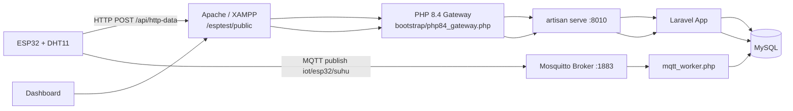

# esptest

[](https://github.com/Fairus-24/esptest)


Full-stack IoT research system for MQTT vs HTTP comparison using ESP32, Laravel, MySQL, Mosquitto, and a real-time web dashboard.

Repository: https://github.com/Fairus-24/esptest

## Why This Project

This project measures and compares:

- latency (`latency_ms`)
- power usage (`daya_mw`)
- reliability
- statistical significance (t-test)

The system ingests data from ESP32 through both MQTT and HTTP, stores results in MySQL, and visualizes everything in one dashboard.

## System Architecture



## Latest Updates (Current State)

The project has been updated with the following behavior:

1. Latency chart is scrollable/pannable horizontally to inspect older points.
2. Chart view defaults to a small visible window (clear and readable) instead of compressing all points.
3. Zoom is controlled by buttons (`+`, `-`, `Reset`) with limits to keep chart clean.
4. Time labels always match total data points exactly.
5. Chart data auto-refreshes every 5 seconds.
6. If user is idle, chart smoothly follows newest data on the right side.
7. Data ordering uses real timestamp order and is displayed in WIB (`Asia/Jakarta`, Surabaya).
8. `Reset Data Eksperimen` correctly clears all experiment data.
9. MQTT worker runs with reconnect loop and lock protection (prevents duplicate worker execution).
10. Auto-start stack scripts were improved for Windows startup and quoting safety.
11. ESP32 firmware sends one humidity field only: `kelembapan` (HTTP and MQTT).
12. HTTP and MQTT ingest now enforce complete required fields: `device_id`, `suhu`, `kelembapan`, `timestamp_esp`, `daya`.
13. Dashboard header metrics (temperature/humidity + connection badges) live-sync during auto-refresh.
14. Dashboard shows protocol field completeness details for MQTT and HTTP.
15. Dashboard shows warning lists when any required field is missing.
16. Protocol `AVG Humidity` cards were removed to keep metric cards clean and focused.
17. Power t-test handles zero-variance datasets (constant power values) without hiding analysis.
18. Reliability now uses a rolling window (latest 300 points/protocol) and combines sequence continuity (`packet_seq`), payload completeness, and transmission health (latency + TX duration quality).
19. Power chart now uses per-data-point time-series (not per-device average), so realtime variation is visible.
20. ESP32 payload generation now uses payload-byte-aware power estimation (two-pass build), so sent `daya` is closer to actual transmission conditions.
21. ESP32 validates required fields before sending/publishing to ensure HTTP and MQTT always carry the same complete core telemetry fields.
22. Protocol payloads include detailed telemetry (`rssi_dbm`, `tx_duration_ms`, `payload_bytes`, `uptime_s`, `free_heap_bytes`) plus send counters for deeper diagnostics.
23. On mobile, `Statistical Analysis` cards are centered and aligned consistently with tablet layout.
24. Auto-refresh now detects `Statistical Analysis` structure changes and reloads once when the section first appears (or structure count changes), so first incoming valid stats are shown immediately.
25. T-test labels now restore statistical symbols (mu, sigma, sigma^2, plus-minus) in the dashboard.
26. Data quality cards now support dropdown minimize/expand; header stays visible with status dot (red if any quality row is warning, green if all rows are healthy).
27. Every T-test card now has a `(?)` help button that explains the meaning of each row/label in that specific card.
28. MQTT worker and Mosquitto auto-start now support broker host fallback (`MQTT_FALLBACK_HOSTS`) so telemetry keeps flowing when primary LAN IP changes.
29. Dashboard now shows explicit host-mismatch warnings when `MQTT_HOST` is unreachable while local broker is reachable (or when `MOSQUITTO_ONLY_LOCAL=true` conflicts with a non-local host).
30. ESP32 firmware now warns when `SERVER_HOST` points to the ESP32 IP itself, and aborts HTTP/MQTT sends to prevent silent misrouting.
31. Dashboard palette/contrast was repaired so header and footer text, badges, and meta labels remain clearly readable on all viewport sizes.
32. Section titles now render with white text/icons, while chart titles use black text with blue icons for clearer hierarchy.
33. T-test subsection headings now include symbols/icons for `Latency Analysis` and `Power Consumption Analysis`.
34. `T-Test Results` cards now use a non-blue statistical accent palette (amber/orange) to visually separate hypothesis-test results from protocol cards.
35. Quality cards now collapse without leaving stretched blank panels when adjacent cards are still expanded.
36. Quality card headers now include protocol-specific icons plus a quality symbol for faster protocol identification.
37. Dashboard background is now unified across desktop, tablet, and mobile using one consistent gradient theme.
38. Project favicon assets were added (`project-favicon.svg`, `project-favicon.png`) and a valid `favicon.ico` fallback was generated.
39. Dashboard `<head>` now includes complete icon/meta tags (SVG/PNG/ICO favicon, theme color, application name).
40. Power Consumption chart now includes the same toolbar as Latency chart (`+`, `-`, `Reset`, bounded zoom, pan, and idle auto-follow).
41. Core sensor fields (`suhu`, `kelembapan`) are intentionally shared from the same ESP32 sensor snapshot for MQTT and HTTP, so values can be identical on the same sampling window.
42. Protocol detail telemetry now includes `sensor_age_ms`, `sensor_read_seq`, and `send_tick_ms`, and dashboard adds a `Protocol Payload Diagnostics` panel with MQTT-vs-HTTP delta metrics.
43. Power chart toolbar now uses default minimum view `15` data points; `+` is disabled at default/min view, and `-` can zoom out up to `120` points.
44. Latency toolbar now shows `Default(min)` and `View saat ini` values directly (replacing the old `View` range label).
45. ESP32 payload validation memory was increased to prevent `Invalid JSON: NoMemory` during HTTP/MQTT send pre-check.
46. ESP32 now captures a fresh sensor snapshot for each protocol send path (HTTP and MQTT), so payload generation no longer reuses protocol data by copy.
47. Dashboard protocol diagnostics now display high-precision temperature/humidity values (up to 8 decimals) and include protocol-independence deltas (`sensor_read_seq`, `send_tick_ms`) with warning hooks.
48. ESP32 power estimation no longer uses random baseline noise, so `daya` is now deterministic from real measured inputs and retry state.
49. All main dashboard cards now include a `(?)` help toggle that explains the meaning of each row/value (header metrics, realtime metric cards, diagnostics cards, quality cards, chart cards, and T-test cards).
50. Reset submit no longer shows raw `Redirecting to ...` text; `POST /reset-data` now returns the same reset page with a styled success/error banner that matches dashboard palette.
51. Open `(?)` help panels now persist during auto-refresh; they no longer auto-close when `Protocol Payload Diagnostics` and quality sections are refreshed.
52. Reset confirmation input now enforces uppercase typing automatically (`RESET`) to prevent casing mistakes during confirmation.
53. Dashboard now includes a floating top-right realtime link monitor (speedtest-style) showing per-protocol ping (`ms`) and throughput (`Mb/s`) computed from latest telemetry (`latency_ms`, `payload_bytes`, `tx_duration_ms`).

## Tech Stack

- Backend: Laravel 12
- Language: PHP 8.2+ (internal Laravel HTTP server uses PHP 8.4 binary in current setup)
- Database: MySQL
- Broker: Mosquitto MQTT
- Firmware: ESP32 Arduino framework (PlatformIO)
- Frontend: Blade + Chart.js + chartjs-plugin-zoom

## Requirements

### Hardware

| Component | Minimum | Notes |
| --- | --- | --- |
| ESP32 board | ESP32 DevKit V1 | Tested with DOIT ESP32 DevKit V1 |
| Temperature/Humidity sensor | DHT11 | Connected to `GPIO 4` in current firmware |
| USB cable | Data-capable cable | Required for flashing + serial monitor |
| Local network | Same LAN for PC + ESP32 | HTTP and MQTT both use LAN routing |

### Software

| Tool | Version (recommended) | Why it is needed |
| --- | --- | --- |
| Windows + XAMPP | Current stable | Apache + MySQL runtime |
| PHP | 8.2+ | Laravel runtime (`8.4` binary used by auto-start in this repo) |
| Composer | 2.x | PHP dependencies |
| Node.js | 18+ | Frontend rebuild only (optional for runtime) |
| Mosquitto | 2.x | MQTT broker on port `1883` |
| PlatformIO | Latest | ESP32 firmware build/upload |

## Pre-Setup Checklist (Values You Must Prepare)

Before editing `.env` or firmware, collect these values first:

| Value | Used in | How to get it |
| --- | --- | --- |
| PC LAN IPv4 (example `192.168.0.104`) | `.env` (`MQTT_HOST`), firmware (`SERVER_HOST`) | On Windows: `ipconfig` -> active adapter -> `IPv4 Address` |
| ESP32 WiFi SSID + password | firmware (`WIFI_SSID`, `WIFI_PASSWORD`) | Router / hotspot settings |
| MySQL DB name/user/password | `.env` (`DB_*`) | XAMPP MySQL user settings / phpMyAdmin |
| MQTT credentials | `.env` + firmware (`MQTT_USERNAME`, `MQTT_PASSWORD`, `MQTT_USER`, `MQTT_PASSWORD`) | Mosquitto config/password file; default in this repo: `esp32/esp32` |
| PHP binary path | `.env` (`LARAVEL_HTTP_PHP_BINARY`) | `where php` on Windows, or Herd/XAMPP PHP absolute path |
| Mosquitto binary + config path | `.env` (`MOSQUITTO_BINARY`, `MOSQUITTO_CONFIG`) | Usually `C:/Program Files/mosquitto/...` |
| Device ID | payload `device_id` | `SELECT id, nama_device FROM devices;` after seed |
| ESP32 COM port | flashing | `pio device list` or Arduino IDE port menu |

Network must-haves:

- PC and ESP32 must be on the same subnet (for example both `192.168.0.x`).
- Firewall must allow MQTT port `1883`.
- Apache/XAMPP must serve `http://<pc-ip>/esptest/public`.
- Do not set firmware `SERVER_HOST` to ESP32 IP itself.

Quick commands to collect required values:

```powershell
# 1) PC LAN IP (use this for MQTT_HOST and SERVER_HOST)
ipconfig

# 2) Find PHP binary path for LARAVEL_HTTP_PHP_BINARY
where php

# 3) Check Mosquitto port status
netstat -ano | findstr :1883

# 4) Validate devices table (get valid device_id values)
php artisan tinker --execute "App\\Models\\Device::select('id','nama_device','lokasi')->get()->toArray();"
```

## Installation

### 1. Clone Repository

```bash
git clone https://github.com/Fairus-24/esptest.git
cd esptest
```

### 2. Install Dependencies

```bash
composer install
npm install
```

### 3. Create Environment File

```bash
copy .env.example .env
php artisan key:generate
```

### 4. Create Database (MySQL)

Example SQL:

```sql
CREATE DATABASE esptest CHARACTER SET utf8mb4 COLLATE utf8mb4_unicode_ci;
```

### 5. Configure `.env` (Database + Services)

```env
DB_CONNECTION=mysql
DB_HOST=127.0.0.1
DB_PORT=3306
DB_DATABASE=esptest
DB_USERNAME=root
DB_PASSWORD=
```

Also set service hosts:

```env
MQTT_HOST=192.168.0.104
MQTT_FALLBACK_HOSTS=localhost,127.0.0.1
LARAVEL_HTTP_PORT=8010
```

### 6. Run Migration + Seed

```bash
php artisan migrate --seed
```

Seeder creates initial devices:

- `id=1` -> `ESP32-1`
- `id=2` -> `ESP32-2`

### 7. Optional but Recommended: Clean Seeded Test Rows Before Live ESP32

Seeder also inserts dummy experiment rows for demo. If you want pure live data:

```bash
php artisan tinker --execute "App\\Models\\Eksperimen::query()->delete();"
```

## Configuration Reference (`.env`)

### Core App + Database

| Key | Required | Example | How to fill |
| --- | --- | --- | --- |
| `APP_URL` | Yes | `http://127.0.0.1/esptest/public` | Match your Apache public URL |
| `DB_CONNECTION` | Yes | `mysql` | Use MySQL in this project |
| `DB_HOST` | Yes | `127.0.0.1` | Local MySQL from XAMPP |
| `DB_PORT` | Yes | `3306` | Default MySQL port |
| `DB_DATABASE` | Yes | `esptest` | From database created in step 4 |
| `DB_USERNAME` | Yes | `root` | Your MySQL user |
| `DB_PASSWORD` | Depends | `` | Your MySQL password |

### MQTT Worker + Broker Targets

| Key | Required | Example | How to fill |
| --- | --- | --- | --- |
| `MQTT_AUTO_START` | Yes | `true` | Auto-start worker from web request |
| `MQTT_HOST` | Yes | `192.168.0.104` | PC LAN IPv4 that runs broker |
| `MQTT_FALLBACK_HOSTS` | Recommended | `localhost,127.0.0.1` | Local fallback targets |
| `MQTT_PORT` | Yes | `1883` | Mosquitto listener port |
| `MQTT_TOPIC` | Yes | `iot/esp32/suhu` | Must match firmware topic |
| `MQTT_CLIENT_ID` | Yes | `laravel-mqtt-worker` | Base client ID; worker appends PID/hash |
| `MQTT_USERNAME` | Yes | `esp32` | Broker credential |
| `MQTT_PASSWORD` | Yes | `esp32` | Broker credential |
| `MQTT_QOS` | Yes | `0` | Current firmware publishes QoS 0 |
| `MQTT_RECONNECT_DELAY` | Yes | `3` | Worker reconnect interval (seconds) |

### Internal Laravel HTTP Auto-start

| Key | Required | Example | How to fill |
| --- | --- | --- | --- |
| `LARAVEL_HTTP_AUTO_START` | Yes | `true` | Auto-start `artisan serve` behind gateway |
| `LARAVEL_HTTP_HOST` | Yes | `0.0.0.0` | Listen on all interfaces |
| `LARAVEL_HTTP_PORT` | Yes | `8010` | Internal port (proxied by Apache gateway) |
| `LARAVEL_HTTP_HEALTH_HOST` | Yes | `127.0.0.1` | Host for health check |
| `LARAVEL_HTTP_HEALTH_PATH` | Yes | `/up` | Health route checked before proxy |
| `LARAVEL_HTTP_PHP_BINARY` | Yes | `C:/Users/LENOVO/.config/herd-lite/bin/php.exe` | Absolute PHP binary path |

### Mosquitto Auto-start

| Key | Required | Example | How to fill |
| --- | --- | --- | --- |
| `MOSQUITTO_AUTO_START` | Yes | `true` | Auto-start local broker if unreachable |
| `MOSQUITTO_ONLY_LOCAL` | Yes | `true` | Safety: only auto-start for local host target |
| `MOSQUITTO_BINARY` | Yes | `C:/Program Files/mosquitto/mosquitto.exe` | Mosquitto executable path |
| `MOSQUITTO_CONFIG` | Yes | `C:/Program Files/mosquitto/mosquitto.conf` | Mosquitto config file |
| `MOSQUITTO_VERBOSE` | Yes | `true` | Verbose broker logs |

### Full Example `.env` Block (Project Defaults)

```env
APP_URL=http://127.0.0.1/esptest/public

DB_CONNECTION=mysql
DB_HOST=127.0.0.1
DB_PORT=3306
DB_DATABASE=esptest
DB_USERNAME=root
DB_PASSWORD=

MQTT_AUTO_START=true
MQTT_AUTO_START_COOLDOWN=20
MQTT_HOST=192.168.0.104
MQTT_FALLBACK_HOSTS=localhost,127.0.0.1
MQTT_PORT=1883
MQTT_TOPIC=iot/esp32/suhu
MQTT_CLIENT_ID=laravel-mqtt-worker
MQTT_USERNAME=esp32
MQTT_PASSWORD=esp32
MQTT_QOS=0
MQTT_CONNECT_TIMEOUT=5
MQTT_SOCKET_TIMEOUT=5
MQTT_KEEP_ALIVE=30
MQTT_RECONNECT_DELAY=3

LARAVEL_HTTP_AUTO_START=true
LARAVEL_HTTP_HOST=0.0.0.0
LARAVEL_HTTP_PORT=8010
LARAVEL_HTTP_HEALTH_HOST=127.0.0.1
LARAVEL_HTTP_HEALTH_PATH=/up
LARAVEL_HTTP_PHP_BINARY="C:/Users/LENOVO/.config/herd-lite/bin/php.exe"
LARAVEL_HTTP_START_COOLDOWN=15
LARAVEL_HTTP_WAIT_SECONDS=8

MOSQUITTO_AUTO_START=true
MOSQUITTO_ONLY_LOCAL=true
MOSQUITTO_BINARY="C:/Program Files/mosquitto/mosquitto.exe"
MOSQUITTO_CONFIG="C:/Program Files/mosquitto/mosquitto.conf"
MOSQUITTO_VERBOSE=true
MOSQUITTO_START_COOLDOWN=20
MOSQUITTO_WAIT_SECONDS=8
```

## Running the System

### Option A (Recommended in this repository)

Use Apache (`http://127.0.0.1/esptest/public`) and let the app auto-start supporting services.

1. Start Apache + MySQL in XAMPP.
2. Open dashboard URL:

```text
http://127.0.0.1/esptest/public
```

What is triggered automatically (via `AppServiceProvider`):

- internal Laravel HTTP server (`artisan serve --port=8010`)
- Mosquitto broker start (if target host is local and broker is down)
- MQTT worker start (`php mqtt_worker.php`) with lock protection

Expected logs:

- `storage/logs/laravel_http_server.log`
- `storage/logs/mosquitto.log`
- `storage/logs/mqtt_worker.log`

If auto-start is disabled or blocked by policy, use manual mode below.

### Option B (Manual Services)

```bash
# terminal 1
php artisan serve --host=0.0.0.0 --port=8010

# terminal 2
php mqtt_worker.php

# terminal 3 (if broker not already running as service)
mosquitto -v -c "C:\Program Files\mosquitto\mosquitto.conf"
```

## Windows Auto-start Scripts

Files:

- `scripts/start_iot_stack.ps1`
- `scripts/register_iot_autostart.ps1`

Register auto-start:

```powershell
powershell -NoProfile -ExecutionPolicy Bypass -File scripts\register_iot_autostart.ps1
```

Registration strategy:

1. Try Scheduled Task `ONSTART` as `SYSTEM` (requires admin privileges).
2. Fallback to Scheduled Task `ONLOGON`.
3. Fallback to Startup folder script.

## ESP32 Firmware

Firmware directory:

```text
ESP32_Firmware/
```

Update these values in `ESP32_Firmware/src/main.cpp` before flash:

| Firmware key | Example | Must match |
| --- | --- | --- |
| `WIFI_SSID` / `WIFI_PASSWORD` | your WiFi | Active WLAN used by ESP32 |
| `SERVER_HOST` | `192.168.0.104` | Same host as Laravel + Mosquitto |
| `HTTP_ENDPOINT` | `/esptest/public/api/http-data` | Laravel API path through Apache |
| `MQTT_SERVER` / `MQTT_PORT` | `192.168.0.104`, `1883` | Broker host/port |
| `MQTT_TOPIC` | `iot/esp32/suhu` | Same as `.env` `MQTT_TOPIC` |
| `MQTT_USER` / `MQTT_PASSWORD` | `esp32` / `esp32` | Same as broker + `.env` |
| `DEVICE_ID` | `1` | Existing row in `devices` table |
| `DHTPIN` / `DHTTYPE` | `4`, `DHT11` | Your sensor wiring |

Important runtime safety:

- Firmware warns and blocks HTTP/MQTT send when `SERVER_HOST` equals ESP32 local IP.
- This prevents accidental self-targeting (`HTTP -1`, `MQTT -2` loops).

How ESP32 fills each payload field:

| Field | Source in firmware |
| --- | --- |
| `device_id` | constant `DEVICE_ID` |
| `suhu` | `dht.readTemperature()` |
| `kelembapan` | `dht.readHumidity()` |
| `timestamp_esp` | NTP-synced Unix timestamp (`time(nullptr)`) |
| `daya` | dynamic estimate from signal, TX duration, payload size, retries, and sensor/system state |
| `packet_seq` | protocol-specific counter (`httpPacketSeq` / `mqttPacketSeq`) |
| `rssi_dbm` | `WiFi.RSSI()` |
| `tx_duration_ms` | measured send duration per protocol |
| `payload_bytes` | final serialized JSON payload length |
| `uptime_s` | `millis()/1000` |
| `free_heap_bytes` | `ESP.getFreeHeap()` |
| `sensor_age_ms` | age of the current sensor snapshot when protocol send starts (`millis() - lastSensorRead`) |
| `sensor_read_seq` | latest sensor read counter used by this payload |
| `send_tick_ms` | ESP32 monotonic send tick (`millis()`) to trace protocol timing order |
| `sensor_reads` | local counter (diagnostic) |
| `http_success_count`/`http_fail_count` | local HTTP counters (diagnostic) |
| `mqtt_success_count`/`mqtt_fail_count` | local MQTT counters (diagnostic) |

Protocol-capture behavior:
- HTTP send path triggers its own sensor snapshot before building payload.
- MQTT send path also triggers its own sensor snapshot before building payload.
- Firmware enforces DHT minimum interval protection to avoid invalid over-read while still keeping protocol captures independent.
- Power estimation is deterministic (no random noise term), computed from RSSI, TX duration, payload size, temperature/humidity contribution, and retry/failure context.

Build and upload:

```bash
cd ESP32_Firmware
pio run
pio run -t upload
pio device monitor
```

If upload fails because COM port is busy:

- close serial monitor first,
- confirm target port with `pio device list`,
- run upload again.

## First Boot Flow (End-to-End, Recommended Order)

Use this order on a fresh machine/session so the stack starts cleanly:

1. Start XAMPP (`Apache` + `MySQL`).
2. Confirm database connection: `php artisan migrate:status`.
3. Open dashboard once: `http://127.0.0.1/esptest/public`.
4. Wait 5-10 seconds for auto-start services.
5. Confirm ports:
   - `1883` (Mosquitto)
   - `8010` (internal Laravel HTTP)
6. Confirm worker log shows active subscription:
   - `storage/logs/mqtt_worker.log`
   - expected line: connected + listening on topic `iot/esp32/suhu`
7. Flash ESP32 with updated `SERVER_HOST` and credentials.
8. Watch serial monitor:
   - HTTP should return status `201`
   - MQTT should publish successfully (no repeated reconnect failures)
9. Refresh dashboard and confirm both protocol counters increase.
10. If seeded dummy rows are still present, reset from dashboard button or clean table manually.

## Fullstack Validation Matrix (What "Healthy" Looks Like)

| Layer | Check | Healthy result |
| --- | --- | --- |
| Laravel API | `POST /api/http-data` | Response `201` + row inserted |
| MQTT Broker | `mosquitto_pub` test publish | Worker log receives message and stores row |
| MQTT Worker | `storage/logs/mqtt_worker.log` | No recurring disconnect/error loop |
| Database | `eksperimens` table growth | New `HTTP` and `MQTT` rows with full required fields |
| Dashboard UI | Auto refresh every 5s | Charts update and slide to latest data |
| ESP32 runtime | Serial monitor | No `HTTP -1` / `MQTT -2` after correct host config |

Recommended DB check:

```sql
SELECT protokol,
       COUNT(*) AS total_rows,
       MIN(packet_seq) AS min_seq,
       MAX(packet_seq) AS max_seq,
       SUM(CASE WHEN kelembapan IS NULL THEN 1 ELSE 0 END) AS missing_humidity
FROM eksperimens
GROUP BY protokol;
```

## API Endpoints

### POST `/api/http-data`

Purpose: store HTTP payload from ESP32.

Sample payload:

```json
{
  "device_id": 1,
  "suhu": 27.9,
  "kelembapan": 60.4,
  "timestamp_esp": 1772021517,
  "daya": 81,
  "packet_seq": 1201,
  "rssi_dbm": -58,
  "tx_duration_ms": 97.5,
  "payload_bytes": 212,
  "uptime_s": 8451,
  "free_heap_bytes": 271232,
  "sensor_age_ms": 1310,
  "sensor_read_seq": 412,
  "send_tick_ms": 9876543,
  "sensor_reads": 412,
  "http_success_count": 120,
  "http_fail_count": 2,
  "mqtt_success_count": 118,
  "mqtt_fail_count": 3
}
```

Success response: `201 Created`.

Validation rules:
- `device_id`: required, must exist in `devices`.
- `suhu`: required numeric (`-50` to `150`).
- `kelembapan`: required numeric (`0` to `100`).
- `timestamp_esp`: required Unix timestamp (seconds).
- `daya`: required numeric (`>= 0`).
- `packet_seq`: required integer (`>= 1`), used for packet-loss reliability.
- `rssi_dbm`: required integer (`-120` to `0`).
- `tx_duration_ms`: required numeric (`>= 0`).
- `payload_bytes`: required integer (`>= 1`).
- `uptime_s`: required integer (`>= 0`).
- `free_heap_bytes`: required integer (`>= 0`).
- `sensor_age_ms`: optional integer (`>= 0`) for protocol timing detail.
- `sensor_read_seq`: optional integer (`>= 0`) for sensor snapshot trace.
- `send_tick_ms`: optional integer (`>= 0`) for ESP32 monotonic send ordering.

### GET `/reset-data`

Purpose: render dedicated reset page with summary cards and guarded confirmation flow.

Used by dashboard button: `Reset Data Eksperimen`.

### POST `/reset-data`

Purpose: clear all records in `eksperimens`.

Used by reset page submit form after user confirms (`checkbox` + typed `RESET`).

Current behavior: after submit, Laravel renders `/reset-data` directly with a styled status banner (success/error), so users do not see raw redirect-text pages.
The confirmation textbox auto-converts all typed characters to uppercase so the required keyword stays consistent.

Note: route is CSRF-exempt in current implementation to avoid gateway/session mismatch (`419 Page Expired`) in this deployment mode.

### GET `/`

Dashboard entry route (served via Apache path `/esptest/public` in this setup).

## Dashboard Behavior

Latency and power charts now behave as follows:

1. Windowed data view (clear readability).
2. Horizontal pan to explore old/new points.
3. Button-only zoom controls with limits (`+`, `-`, `Reset`) on both chart cards.
4. Auto-refresh every 5 seconds.
5. Smooth auto-follow to latest data when user is idle.
6. Time labels displayed as WIB (`Asia/Jakarta`).
7. Point order strictly follows realtime timestamp + tie-breaker.

Other dashboard behavior:

- T-test summary for latency and power
- protocol-level summary cards
- dedicated reset experiment data button
- dedicated `/reset-data` management page with synchronized dashboard palette and guarded reset confirmation
- floating top-right `Realtime Link Monitor` (MQTT/HTTP ping ms + throughput Mb/s from latest real payload telemetry)
- modernized header cards for temperature and humidity
- live status badges for MQTT and HTTP connectivity
- responsive layout tuned for desktop, tablet, and mobile
- mobile and tablet keep temperature and humidity header cards aligned side-by-side
- chart containers enforce visible height on small screens (mobile chart no longer collapses)
- protocol field-completeness panel (detail per field for MQTT and HTTP)
- warning list for any missing required field data
- quality cards can be collapsed like dropdowns while keeping the header visible
- quality header shows status dot: red when any row is warning, green when all rows are OK
- warning list now includes broker host-mismatch diagnostics (`MQTT_HOST` vs reachable local broker) to make IP issues visible without opening logs
- reliability card now includes sequence continuity (`received/expected`), payload completeness, and transmission-health score
- power chart now plots realtime power per data point (windowed view) instead of static per-device averages
- power statistical section remains visible even when variance is zero (constant dataset case)
- each T-test card provides an inline `(?)` explanation panel for all row labels/values
- all major dashboard cards now provide a `(?)` explanation panel so each row/value meaning is visible directly in-context
- open `(?)` help panel state is preserved across 5-second auto-refresh (especially on `Protocol Payload Diagnostics` cards)
- statistical cards remain centered on mobile, matching tablet alignment/flow
- when `Statistical Analysis` appears for the first time during auto-refresh, the page reloads once to sync the full section
- t-test labels use standard statistical symbols (mu, sigma, sigma^2, plus-minus)
- header/footer now use high-contrast palette tokens so text is not washed out against gradients or translucent backgrounds
- section headings use white typography/icons and chart headings use black text with blue icons
- T-test subsection `h3` titles now include icons for faster visual scanning
- T-test result cards use amber/orange accents (not blue) for clearer semantic distinction
- quality card grid uses non-stretch alignment so minimized cards keep compact height
- quality card header includes quality icon + protocol icon (`MQTT`/`HTTP`)
- dashboard background is now the same gradient theme on desktop/tablet/mobile
- favicon setup now includes project SVG + PNG icons with a non-empty ICO fallback for browser compatibility
- favicon/meta tags are configured in `<head>` for consistent browser tab identity
- protocol diagnostics panel now shows latest payload detail per protocol (MQTT + HTTP) and signed delta values for key fields
- dashboard now explicitly explains when suhu/kelembapan are identical because both protocols use the same sensor snapshot window
- latency toolbar now displays `Default(min)` and `View saat ini` for active window tracking (without the old `View` range text)
- power chart default/min visible window is 15 points; zoom-in cannot go below this default and zoom-out is capped at 120 points
- protocol diagnostics now shows suhu/kelembapan in high precision (8 decimals) to reflect actual stored payload values
- dashboard warning list flags possible cross-protocol snapshot reuse when latest `sensor_read_seq` or `send_tick_ms` is identical
- after flashing latest firmware, latest HTTP and MQTT rows should usually show different `sensor_read_seq` values when both protocols capture independently

## Reliability Formula (Current)

Reliability is computed per protocol from the latest `300` records:

- with sequence available:
  - `55%` sequence continuity (`packet_seq`)
  - `25%` required-field completeness
  - `20%` transmission health (latency + TX duration quality)
- without sequence:
  - `60%` required-field completeness
  - `40%` transmission health

## Data Model

### `devices`

- `id`
- `nama_device`
- `lokasi`
- timestamps

### `eksperimens`

- `id`
- `device_id` (FK -> `devices.id`)
- `protokol` (`MQTT` or `HTTP`)
- `suhu`
- `kelembapan` (required at ingest, legacy rows may still be `NULL`)
- `timestamp_esp`
- `timestamp_server`
- `latency_ms`
- `daya_mw`
- `packet_seq`
- `rssi_dbm`
- `tx_duration_ms`
- `payload_bytes`
- `uptime_s`
- `free_heap_bytes`
- `sensor_age_ms` (optional protocol timing detail)
- `sensor_read_seq` (optional sensor snapshot counter)
- `send_tick_ms` (optional ESP32 send-order tick)
- timestamps

## Quick Verification Checklist

### Backend + DB

```bash
php artisan migrate:status
```

### HTTP ingest

```powershell
$body = @{
  device_id = 1
  suhu = 26.7
  kelembapan = 59.8
  timestamp_esp = [DateTimeOffset]::UtcNow.ToUnixTimeSeconds()
  daya = 79.5
  packet_seq = 101
  rssi_dbm = -60
  tx_duration_ms = 96.2
  payload_bytes = 210
  uptime_s = 7200
  free_heap_bytes = 265000
  sensor_age_ms = 1200
  sensor_read_seq = 321
  send_tick_ms = 1234567
} | ConvertTo-Json -Compress

Invoke-RestMethod -Method Post `
  -Uri "http://127.0.0.1/esptest/public/api/http-data" `
  -ContentType "application/json" `
  -Body $body
```

### MQTT ingest

```powershell
mosquitto_pub -h 127.0.0.1 -p 1883 -u esp32 -P esp32 -t iot/esp32/suhu -m "{\"device_id\":1,\"suhu\":27.9,\"kelembapan\":60.4,\"timestamp_esp\":1772021517,\"daya\":81,\"packet_seq\":101,\"rssi_dbm\":-60,\"tx_duration_ms\":45.2,\"payload_bytes\":208,\"uptime_s\":7200,\"free_heap_bytes\":265000,\"sensor_age_ms\":980,\"sensor_read_seq\":444,\"send_tick_ms\":9876543}"
```

### Service state
```powershell
netstat -ano | findstr :1883
netstat -ano | findstr :8010
```

### Data completeness audit (HTTP vs MQTT)

```sql
SELECT protokol,
       COUNT(*) AS total_rows,
       SUM(CASE WHEN suhu IS NULL THEN 1 ELSE 0 END) AS miss_suhu,
       SUM(CASE WHEN kelembapan IS NULL THEN 1 ELSE 0 END) AS miss_kelembapan,
       SUM(CASE WHEN timestamp_esp IS NULL THEN 1 ELSE 0 END) AS miss_timestamp_esp,
       SUM(CASE WHEN daya_mw IS NULL THEN 1 ELSE 0 END) AS miss_daya,
       SUM(CASE WHEN packet_seq IS NULL THEN 1 ELSE 0 END) AS miss_packet_seq,
       SUM(CASE WHEN rssi_dbm IS NULL THEN 1 ELSE 0 END) AS miss_rssi,
       SUM(CASE WHEN tx_duration_ms IS NULL THEN 1 ELSE 0 END) AS miss_tx_duration,
       SUM(CASE WHEN payload_bytes IS NULL THEN 1 ELSE 0 END) AS miss_payload_bytes,
       SUM(CASE WHEN uptime_s IS NULL THEN 1 ELSE 0 END) AS miss_uptime,
       SUM(CASE WHEN free_heap_bytes IS NULL THEN 1 ELSE 0 END) AS miss_free_heap,
       SUM(CASE WHEN sensor_age_ms IS NULL THEN 1 ELSE 0 END) AS miss_sensor_age,
       SUM(CASE WHEN sensor_read_seq IS NULL THEN 1 ELSE 0 END) AS miss_sensor_read_seq,
       SUM(CASE WHEN send_tick_ms IS NULL THEN 1 ELSE 0 END) AS miss_send_tick
FROM eksperimens
GROUP BY protokol;
```

## Troubleshooting

### Reset button shows `419 Page Expired`

- Open reset flow from dashboard button first (`GET /reset-data`), then submit reset from that page.
- Ensure route `POST /reset-data` is configured exactly as current code.
- Verify access path is `http://127.0.0.1/esptest/public`.

### Reset page shows raw `Redirecting to http://localhost:8000`

- Current code should no longer redirect on reset submit; it renders the same `/reset-data` page with a styled status banner.
- If you still see raw redirect text, clear compiled views/cache and restart HTTP gateway stack:
  - `php artisan optimize:clear`
  - restart Apache/XAMPP and Laravel HTTP worker process.

### Humidity value not shown on dashboard

- Confirm payload includes `kelembapan` for both HTTP and MQTT.
- Confirm API endpoint `/api/http-data` returns `201` for test payload with `kelembapan`.
- Verify new data rows in `eksperimens` have non-null `kelembapan`.
- Remember: old records created before this fix may contain `NULL` humidity values.

### Temperature/Humidity look identical between MQTT and HTTP

- This is expected when both protocol sends use the same latest sensor snapshot on ESP32.
- Use dashboard `Protocol Payload Diagnostics` to inspect actual transport differences:
  latency, tx duration, payload bytes, RSSI, sensor age, packet sequence, and server timestamp gap.

### Warning list appears for missing fields

- Open dashboard data quality panel and see which protocol/field has missing values.
- Ensure both protocol payloads always include all core required fields:
  `device_id`, `suhu`, `kelembapan`, `timestamp_esp`, `daya`, `packet_seq`, `rssi_dbm`, `tx_duration_ms`, `payload_bytes`, `uptime_s`, `free_heap_bytes`.
- For full diagnostics parity, also send:
  `sensor_age_ms`, `sensor_read_seq`, `send_tick_ms`.
- If warnings persist, inspect latest MQTT worker logs and HTTP API validation responses.
- Legacy rows created before telemetry migration can still trigger warnings until new data replaces them or data is reset.

### Dashboard shows no new data

- Check MQTT worker log for broker connection errors:
  `storage/logs/mqtt_worker.log`.
- Verify MQTT host in `.env` points to the same broker endpoint used by ESP32:
  `MQTT_HOST=192.168.0.104` and `MQTT_FALLBACK_HOSTS=localhost,127.0.0.1`.
- If dashboard shows `Host mismatch terdeteksi`, fix `.env` and firmware host immediately so both point to the same active machine IP.
- If ESP32 cannot send HTTP/MQTT, re-check firmware `SERVER_HOST` against your current PC LAN IP (`ipconfig`).
- Restart worker after host changes so new config is loaded:
  `php mqtt_worker.php`.

### ESP32 shows HTTP code `-1` and MQTT code `-2`

- This usually means ESP32 is targeting the wrong server IP (often itself).
- In serial monitor, if WiFi IP is `192.168.0.100`, do not set `SERVER_HOST` to `192.168.0.100` unless your Laravel/Mosquitto host is truly on that IP.
- Set firmware `SERVER_HOST` to the actual PC host IP (example: `192.168.0.104`), then rebuild and flash:
  `pio run -t upload`.
- Keep Laravel worker broker target aligned with ESP32:
  `.env MQTT_HOST` should be the same host as firmware `MQTT_SERVER`.

### Power Consumption Analysis not visible

- Previous behavior could hide the section when power variance was exactly zero.
- Current behavior treats zero-variance constant data as a valid statistical edge case, so the section is still rendered.
- If values are all constant and equal, expected result is `t_value = 0`, `p_value = 1`, and not significant.

### Power data still looks too constant

- Ensure ESP32 firmware is re-flashed with the latest `ESP32_Firmware/src/main.cpp`.
- Confirm payload includes telemetry fields (`rssi_dbm`, `tx_duration_ms`, `payload_bytes`) because these are used in dynamic power estimation.
- Check dashboard warning list: if `std_daya` is very low (`< 0.5`) for many rows, firmware telemetry may still be stale/old.

### MQTT payload rejected (`Payload MQTT bukan JSON valid`)

- Ensure JSON is properly quoted when using `mosquitto_pub`.
- Prefer command format shown in this README.

### ESP32 shows `Invalid JSON: NoMemory`

- This means JSON validation buffer on firmware is too small for current payload size.
- Update to latest firmware in this repository and re-flash:
  `pio run -t upload`.
- Current firmware uses larger JSON capacities (`PAYLOAD_JSON_DOC_CAPACITY=1024`, `PAYLOAD_VERIFY_DOC_CAPACITY=1536`) to avoid this error.
- If you add more payload fields in future, increase these constants again and rebuild.

### ESP32 upload fails (`COMx access denied`)

- Close serial monitor and any app locking the COM port.
- Re-run:

```bash
pio run -t upload
```

### Broker conflict / multiple Mosquitto instances

- If Windows Mosquitto service is already active, consider disabling app-level broker auto-start:

```env
MOSQUITTO_AUTO_START=false
```

## Key Files

- `app/Providers/AppServiceProvider.php`
- `app/Services/LaravelHttpAutoStarter.php`
- `app/Services/MosquittoAutoStarter.php`
- `app/Services/MqttWorkerAutoStarter.php`
- `mqtt_worker.php`
- `bootstrap/php84_gateway.php`
- `scripts/start_iot_stack.ps1`
- `scripts/register_iot_autostart.ps1`
- `resources/views/dashboard.blade.php`
- `app/Http/Controllers/DashboardController.php`
- `app/Http/Controllers/ApiController.php`
- `ESP32_Firmware/src/main.cpp`

## Maintenance Policy

Project rule:

- Every behavior/config/API/UI/firmware change must update this `README.md` so documentation always matches implementation.

## License

For research and educational use.

---

Last updated: 2026-02-26

## UI Footer Redesign (2026)

The dashboard footer was redesigned for a more modern, professional look:
- Removed card-like border, shadow, and rounded corners
- Uses a clean, minimal bar with subtle top border and transparent background
- Technology badges (MySQL, Laravel, Chart.js, T-Test) remain, but with softer colors and improved spacing
- All changes are in the inline CSS of `resources/views/dashboard.blade.php`

If you do not see the new style, clear your browser cache or do a hard refresh (Ctrl+F5).
