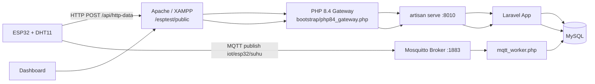

# esptest

[](https://github.com/Fairus-24/esptest)


Full-stack IoT research system for MQTT vs HTTP comparison using ESP32, Laravel, MySQL, Mosquitto, and a real-time web dashboard.

Repository: https://github.com/Fairus-24/esptest

## Why This Project

This project measures and compares:

- latency (`latency_ms`)
- power usage (`daya_mw`)
- reliability
- statistical significance (t-test)

The system ingests data from ESP32 through both MQTT and HTTP, stores results in MySQL, and visualizes everything in one dashboard.

## System Architecture



## Latest Updates (Current State)

The project has been updated with the following behavior:

1. Latency chart is scrollable/pannable horizontally to inspect older points.
2. Chart view defaults to a small visible window (clear and readable) instead of compressing all points.
3. Zoom is controlled by buttons (`+`, `-`, `Reset`) with limits to keep chart clean.
4. Time labels always match total data points exactly.
5. Chart data auto-refreshes every 5 seconds.
6. If user is idle, chart smoothly follows newest data on the right side.
7. Data ordering uses real timestamp order and is displayed in WIB (`Asia/Jakarta`, Surabaya).
8. `Reset Data Eksperimen` correctly clears all experiment data.
9. MQTT worker runs with reconnect loop and lock protection (prevents duplicate worker execution).
10. Auto-start stack scripts were improved for Windows startup and quoting safety.
11. ESP32 firmware sends one humidity field only: `kelembapan` (HTTP and MQTT).
12. HTTP and MQTT ingest now enforce complete required fields: `device_id`, `suhu`, `kelembapan`, `timestamp_esp`, `daya`.
13. Dashboard header metrics (temperature/humidity + connection badges) live-sync during auto-refresh.
14. Dashboard shows protocol field completeness details for MQTT and HTTP.
15. Dashboard shows warning lists when any required field is missing.
16. Protocol `AVG Humidity` cards were removed to keep metric cards clean and focused.
17. Power t-test handles zero-variance datasets (constant power values) without hiding analysis.
18. Reliability now uses a rolling window (latest 300 points/protocol) and combines sequence continuity (`packet_seq`), payload completeness, and transmission health (latency + TX duration quality).
19. Power chart now uses per-data-point time-series (not per-device average), so realtime variation is visible.
20. ESP32 payload generation now uses payload-byte-aware power estimation (two-pass build), so sent `daya` is closer to actual transmission conditions.
21. ESP32 validates required fields before sending/publishing to ensure HTTP and MQTT always carry the same complete core telemetry fields.
22. Protocol payloads include detailed telemetry (`rssi_dbm`, `tx_duration_ms`, `payload_bytes`, `uptime_s`, `free_heap_bytes`) plus send counters for deeper diagnostics.
23. On mobile, `Statistical Analysis` cards are centered and aligned consistently with tablet layout.

## Tech Stack

- Backend: Laravel 12
- Language: PHP 8.2+ (internal Laravel HTTP server uses PHP 8.4 binary in current setup)
- Database: MySQL
- Broker: Mosquitto MQTT
- Firmware: ESP32 Arduino framework (PlatformIO)
- Frontend: Blade + Chart.js + chartjs-plugin-zoom

## Requirements

### Hardware

- ESP32 DevKit (DOIT ESP32 DevKit V1)
- DHT11 sensor
- USB cable

### Software

- Windows + XAMPP (Apache + MySQL)
- PHP/Composer
- Node.js (only if rebuilding frontend assets)
- Mosquitto
- PlatformIO (for firmware)

## Installation

### 1. Clone Repository

```bash
git clone https://github.com/Fairus-24/esptest.git
cd esptest
```

### 2. Install Dependencies

```bash
composer install
npm install
```

### 3. Create Environment File

```bash
copy .env.example .env
php artisan key:generate
```

### 4. Configure Database in `.env`

```env
DB_CONNECTION=mysql
DB_HOST=127.0.0.1
DB_PORT=3306
DB_DATABASE=esptest
DB_USERNAME=root
DB_PASSWORD=
```

### 5. Run Migration + Seed

```bash
php artisan migrate --seed
```

Seeder creates initial devices:

- `id=1` -> `ESP32-1`
- `id=2` -> `ESP32-2`

## Configuration Reference (`.env`)

### MQTT

```env
MQTT_AUTO_START=true
MQTT_HOST=192.168.0.100
MQTT_PORT=1883
MQTT_TOPIC=iot/esp32/suhu
MQTT_CLIENT_ID=laravel-mqtt-worker
MQTT_USERNAME=esp32
MQTT_PASSWORD=esp32
MQTT_KEEP_ALIVE=30
MQTT_RECONNECT_DELAY=3
```

### Internal Laravel HTTP Server

```env
LARAVEL_HTTP_AUTO_START=true
LARAVEL_HTTP_HOST=0.0.0.0
LARAVEL_HTTP_PORT=8010
LARAVEL_HTTP_HEALTH_HOST=127.0.0.1
LARAVEL_HTTP_HEALTH_PATH=/up
LARAVEL_HTTP_PHP_BINARY="C:/Users/LENOVO/.config/herd-lite/bin/php.exe"
```

### Mosquitto Auto-start

```env
MOSQUITTO_AUTO_START=true
MOSQUITTO_ONLY_LOCAL=true
MOSQUITTO_BINARY="C:/Program Files/mosquitto/mosquitto.exe"
MOSQUITTO_CONFIG="C:/Program Files/mosquitto/mosquitto.conf"
MOSQUITTO_VERBOSE=true
```

## Running the System

### Option A (Recommended in this repository)

Use Apache (`http://127.0.0.1/esptest/public`) and let app auto-start supporting services.

1. Start Apache + MySQL in XAMPP.
2. Open:

```text
http://127.0.0.1/esptest/public
```

This triggers:

- internal Laravel server auto-start
- Mosquitto auto-start (if needed)
- MQTT worker auto-start (if not running)

### Option B (Manual Services)

```bash
# terminal 1
php artisan serve --host=0.0.0.0 --port=8010

# terminal 2
php mqtt_worker.php

# terminal 3 (if broker not already running as service)
mosquitto -v -c "C:\Program Files\mosquitto\mosquitto.conf"
```

## Windows Auto-start Scripts

Files:

- `scripts/start_iot_stack.ps1`
- `scripts/register_iot_autostart.ps1`

Register auto-start:

```powershell
powershell -NoProfile -ExecutionPolicy Bypass -File scripts\register_iot_autostart.ps1
```

Registration strategy:

1. Try Scheduled Task `ONSTART` as `SYSTEM` (requires admin privileges).
2. Fallback to Scheduled Task `ONLOGON`.
3. Fallback to Startup folder script.

## ESP32 Firmware

Firmware directory:

```text
ESP32_Firmware/
```

Current important settings in `ESP32_Firmware/src/main.cpp`:

- `HTTP_SERVER = "http://192.168.0.100"`
- `HTTP_ENDPOINT = "/esptest/public/api/http-data"`
- `MQTT_SERVER = "192.168.0.100"`
- `MQTT_TOPIC = "iot/esp32/suhu"`
- DHT pin: `GPIO 4`
- Sensor type: `DHT11`

Build and upload:

```bash
cd ESP32_Firmware
pio run
pio run -t upload
pio device monitor
```

## API Endpoints

### POST `/api/http-data`

Purpose: store HTTP payload from ESP32.

Sample payload:

```json
{
  "device_id": 1,
  "suhu": 27.9,
  "kelembapan": 60.4,
  "timestamp_esp": 1772021517,
  "daya": 81,
  "packet_seq": 1201,
  "rssi_dbm": -58,
  "tx_duration_ms": 97.5,
  "payload_bytes": 212,
  "uptime_s": 8451,
  "free_heap_bytes": 271232,
  "sensor_reads": 412,
  "http_success_count": 120,
  "http_fail_count": 2,
  "mqtt_success_count": 118,
  "mqtt_fail_count": 3
}
```

Success response: `201 Created`.

Validation rules:
- `device_id`: required, must exist in `devices`.
- `suhu`: required numeric (`-50` to `150`).
- `kelembapan`: required numeric (`0` to `100`).
- `timestamp_esp`: required Unix timestamp (seconds).
- `daya`: required numeric (`>= 0`).
- `packet_seq`: required integer (`>= 1`), used for packet-loss reliability.
- `rssi_dbm`: required integer (`-120` to `0`).
- `tx_duration_ms`: required numeric (`>= 0`).
- `payload_bytes`: required integer (`>= 1`).
- `uptime_s`: required integer (`>= 0`).
- `free_heap_bytes`: required integer (`>= 0`).

### POST `/reset-data`

Purpose: clear all records in `eksperimens`.

Used by dashboard button: `Reset Data Eksperimen`.

Note: route is CSRF-exempt in current implementation to avoid gateway/session mismatch (`419 Page Expired`) in this deployment mode.

### GET `/`

Dashboard entry route (served via Apache path `/esptest/public` in this setup).

## Dashboard Behavior

The latency chart now behaves as follows:

1. Windowed data view (clear readability).
2. Horizontal pan to explore old/new points.
3. Button-only zoom controls with limits.
4. Auto-refresh every 5 seconds.
5. Smooth auto-follow to latest data when user is idle.
6. Time labels displayed as WIB (`Asia/Jakarta`).
7. Point order strictly follows realtime timestamp + tie-breaker.

Other dashboard behavior:

- T-test summary for latency and power
- protocol-level summary cards
- dedicated reset experiment data button
- modernized header cards for temperature and humidity
- live status badges for MQTT and HTTP connectivity
- responsive layout tuned for desktop, tablet, and mobile
- mobile and tablet keep temperature and humidity header cards aligned side-by-side
- chart containers enforce visible height on small screens (mobile chart no longer collapses)
- protocol field-completeness panel (detail per field for MQTT and HTTP)
- warning list for any missing required field data
- reliability card now includes sequence continuity (`received/expected`), payload completeness, and transmission-health score
- power chart now plots realtime power per data point (windowed view) instead of static per-device averages
- power statistical section remains visible even when variance is zero (constant dataset case)
- statistical cards remain centered on mobile, matching tablet alignment/flow

## Reliability Formula (Current)

Reliability is computed per protocol from the latest `300` records:

- with sequence available:
  - `55%` sequence continuity (`packet_seq`)
  - `25%` required-field completeness
  - `20%` transmission health (latency + TX duration quality)
- without sequence:
  - `60%` required-field completeness
  - `40%` transmission health

## Data Model

### `devices`

- `id`
- `nama_device`
- `lokasi`
- timestamps

### `eksperimens`

- `id`
- `device_id` (FK -> `devices.id`)
- `protokol` (`MQTT` or `HTTP`)
- `suhu`
- `kelembapan` (required at ingest, legacy rows may still be `NULL`)
- `timestamp_esp`
- `timestamp_server`
- `latency_ms`
- `daya_mw`
- `packet_seq`
- `rssi_dbm`
- `tx_duration_ms`
- `payload_bytes`
- `uptime_s`
- `free_heap_bytes`
- timestamps

## Quick Verification Checklist

### Backend + DB

```bash
php artisan migrate:status
```

### HTTP ingest

```powershell
$body = @{
  device_id = 1
  suhu = 26.7
  kelembapan = 59.8
  timestamp_esp = [DateTimeOffset]::UtcNow.ToUnixTimeSeconds()
  daya = 79.5
  packet_seq = 101
  rssi_dbm = -60
  tx_duration_ms = 96.2
  payload_bytes = 210
  uptime_s = 7200
  free_heap_bytes = 265000
} | ConvertTo-Json -Compress

Invoke-RestMethod -Method Post `
  -Uri "http://127.0.0.1/esptest/public/api/http-data" `
  -ContentType "application/json" `
  -Body $body
```

### MQTT ingest

```powershell
mosquitto_pub -h 192.168.0.100 -p 1883 -u esp32 -P esp32 -t iot/esp32/suhu -m "{\"device_id\":1,\"suhu\":27.9,\"kelembapan\":60.4,\"timestamp_esp\":1772021517,\"daya\":81,\"packet_seq\":101,\"rssi_dbm\":-60,\"tx_duration_ms\":45.2,\"payload_bytes\":208,\"uptime_s\":7200,\"free_heap_bytes\":265000}"
```

### Service state
```powershell
netstat -ano | findstr :1883
netstat -ano | findstr :8010
```

## Troubleshooting

### Reset button shows `419 Page Expired`

- Ensure route `POST /reset-data` is configured exactly as current code.
- Verify access path is `http://127.0.0.1/esptest/public`.

### Humidity value not shown on dashboard

- Confirm payload includes `kelembapan` for both HTTP and MQTT.
- Confirm API endpoint `/api/http-data` returns `201` for test payload with `kelembapan`.
- Verify new data rows in `eksperimens` have non-null `kelembapan`.
- Remember: old records created before this fix may contain `NULL` humidity values.

### Warning list appears for missing fields

- Open dashboard data quality panel and see which protocol/field has missing values.
- Ensure both protocol payloads always include all required fields:
  `device_id`, `suhu`, `kelembapan`, `timestamp_esp`, `daya`, `packet_seq`, `rssi_dbm`, `tx_duration_ms`, `payload_bytes`, `uptime_s`, `free_heap_bytes`.
- If warnings persist, inspect latest MQTT worker logs and HTTP API validation responses.
- Legacy rows created before telemetry migration can still trigger warnings until new data replaces them or data is reset.

### Power Consumption Analysis not visible

- Previous behavior could hide the section when power variance was exactly zero.
- Current behavior treats zero-variance constant data as a valid statistical edge case, so the section is still rendered.
- If values are all constant and equal, expected result is `t_value = 0`, `p_value = 1`, and not significant.

### Power data still looks too constant

- Ensure ESP32 firmware is re-flashed with the latest `ESP32_Firmware/src/main.cpp`.
- Confirm payload includes telemetry fields (`rssi_dbm`, `tx_duration_ms`, `payload_bytes`) because these are used in dynamic power estimation.
- Check dashboard warning list: if `std_daya` is very low (`< 0.5`) for many rows, firmware telemetry may still be stale/old.

### MQTT payload rejected (`Payload MQTT bukan JSON valid`)

- Ensure JSON is properly quoted when using `mosquitto_pub`.
- Prefer command format shown in this README.

### ESP32 upload fails (`COMx access denied`)

- Close serial monitor and any app locking the COM port.
- Re-run:

```bash
pio run -t upload
```

### Broker conflict / multiple Mosquitto instances

- If Windows Mosquitto service is already active, consider disabling app-level broker auto-start:

```env
MOSQUITTO_AUTO_START=false
```

## Key Files

- `app/Providers/AppServiceProvider.php`
- `app/Services/LaravelHttpAutoStarter.php`
- `app/Services/MosquittoAutoStarter.php`
- `app/Services/MqttWorkerAutoStarter.php`
- `mqtt_worker.php`
- `bootstrap/php84_gateway.php`
- `scripts/start_iot_stack.ps1`
- `scripts/register_iot_autostart.ps1`
- `resources/views/dashboard.blade.php`
- `app/Http/Controllers/DashboardController.php`
- `app/Http/Controllers/ApiController.php`
- `ESP32_Firmware/src/main.cpp`

## Maintenance Policy

Project rule:

- Every behavior/config/API/UI/firmware change must update this `README.md` so documentation always matches implementation.

## License

For research and educational use.

---

Last updated: 2026-02-25
