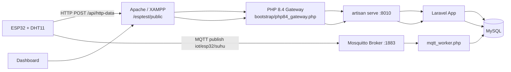

# esptest

[](https://github.com/Fairus-24/esptest)


Full-stack IoT research system for MQTT vs HTTP comparison using ESP32, Laravel, MySQL, Mosquitto, and a real-time web dashboard.

Repository: https://github.com/Fairus-24/esptest

## Why This Project

This project measures and compares:

- latency (`latency_ms`)
- power usage (`daya_mw`)
- reliability
- statistical significance (t-test)

The system ingests data from ESP32 through both MQTT and HTTP, stores results in MySQL, and visualizes everything in one dashboard.

## System Architecture



## Latest Updates (Current State)

The project has been updated with the following behavior:

1. Latency chart is scrollable/pannable horizontally to inspect older points.
2. Chart view defaults to a small visible window (clear and readable) instead of compressing all points.
3. Zoom is controlled by buttons (`+`, `-`, `Reset`) with limits to keep chart clean.
4. Time labels always match total data points exactly.
5. Chart data auto-refreshes every 5 seconds.
6. If user is idle, chart smoothly follows newest data on the right side.
7. Data ordering uses real timestamp order and is displayed in WIB (`Asia/Jakarta`, Surabaya).
8. `Reset Data Eksperimen` correctly clears all experiment data.
9. MQTT worker runs with reconnect loop and lock protection (prevents duplicate worker execution).
10. Auto-start stack scripts were improved for Windows startup and quoting safety.
11. ESP32 firmware sends one humidity field only: `kelembapan` (HTTP and MQTT).
12. HTTP and MQTT ingest now enforce complete required fields: `device_id`, `suhu`, `kelembapan`, `timestamp_esp`, `daya`.
13. Dashboard header metrics (temperature/humidity + connection badges) live-sync during auto-refresh.
14. Dashboard shows protocol field completeness details for MQTT and HTTP.
15. Dashboard shows warning lists when any required field is missing.
16. Protocol `AVG Humidity` cards were removed to keep metric cards clean and focused.
17. Power t-test handles zero-variance datasets (constant power values) without hiding analysis.
18. Reliability now uses a rolling window (latest 300 points/protocol) and combines sequence continuity (`packet_seq`), payload completeness, and transmission health (latency + TX duration quality).
19. Power chart now uses per-data-point time-series (not per-device average), so realtime variation is visible.
20. ESP32 payload generation now uses payload-byte-aware power estimation (two-pass build), so sent `daya` is closer to actual transmission conditions.
21. ESP32 validates required fields before sending/publishing to ensure HTTP and MQTT always carry the same complete core telemetry fields.
22. Protocol payloads include detailed telemetry (`rssi_dbm`, `tx_duration_ms`, `payload_bytes`, `uptime_s`, `free_heap_bytes`) plus send counters for deeper diagnostics.
23. On mobile, `Statistical Analysis` cards are centered and aligned consistently with tablet layout.
24. Auto-refresh now detects `Statistical Analysis` structure changes and reloads once when the section first appears (or structure count changes), so first incoming valid stats are shown immediately.
25. T-test labels now restore statistical symbols (mu, sigma, sigma^2, plus-minus) in the dashboard.
26. Data quality cards now support dropdown minimize/expand; header stays visible with status dot (red if any quality row is warning, green if all rows are healthy).
27. Every T-test card now has a `(?)` help button that explains the meaning of each row/label in that specific card.
28. MQTT worker and Mosquitto auto-start now support broker host fallback (`MQTT_FALLBACK_HOSTS`) so telemetry keeps flowing when primary LAN IP changes.
29. Dashboard now shows explicit host-mismatch warnings when `MQTT_HOST` is unreachable while local broker is reachable (or when `MOSQUITTO_ONLY_LOCAL=true` conflicts with a non-local host).
30. ESP32 firmware now warns when `SERVER_HOST` points to the ESP32 IP itself, and aborts HTTP/MQTT sends to prevent silent misrouting.
31. Dashboard palette/contrast was repaired so header and footer text, badges, and meta labels remain clearly readable on all viewport sizes.
32. Section titles now render with white text/icons, while chart titles use black text with blue icons for clearer hierarchy.
33. T-test subsection headings now include symbols/icons for `Latency Analysis` and `Power Consumption Analysis`.
34. `T-Test Results` cards now use a non-blue statistical accent palette (amber/orange) to visually separate hypothesis-test results from protocol cards.
35. Quality cards now collapse without leaving stretched blank panels when adjacent cards are still expanded.
36. Quality card headers now include protocol-specific icons plus a quality symbol for faster protocol identification.
37. Dashboard background is now unified across desktop, tablet, and mobile using one consistent gradient theme.
38. Project favicon assets were added (`project-favicon.svg`, `project-favicon.png`) and a valid `favicon.ico` fallback was generated.
39. Dashboard `<head>` now includes complete icon/meta tags (SVG/PNG/ICO favicon, theme color, application name).
40. Power Consumption chart now includes the same toolbar as Latency chart (`+`, `-`, `Reset`, bounded zoom, pan, and idle auto-follow).
41. Core sensor fields (`suhu`, `kelembapan`) now prioritize dedicated per-protocol reads at send time (HTTP and MQTT capture independently), so identical cross-protocol values are less likely unless environment is truly stable.
42. Protocol detail telemetry now includes `sensor_age_ms`, `sensor_read_seq`, and `send_tick_ms`, and dashboard adds a `Protocol Payload Diagnostics` panel with MQTT-vs-HTTP delta metrics.
43. Power chart toolbar now uses default minimum view `15` data points; `+` is disabled at default/min view, and `-` can zoom out up to `120` points.
44. Latency toolbar now shows `Default(min)` and `View saat ini` values directly (replacing the old `View` range label).
45. ESP32 payload validation memory was increased to prevent `Invalid JSON: NoMemory` during HTTP/MQTT send pre-check.
46. ESP32 keeps background sensor polling for runtime stability, but each HTTP/MQTT send now attempts a dedicated sensor capture first and only falls back to recent snapshot when direct read fails.
47. Dashboard protocol diagnostics now display high-precision temperature/humidity values (up to 8 decimals) and include protocol-independence deltas (`sensor_read_seq`, `send_tick_ms`) with warning hooks.
48. ESP32 power estimation no longer uses random baseline noise, so `daya` is now deterministic from real measured inputs and retry state.
49. All main dashboard cards now include a `(?)` help toggle that explains the meaning of each row/value (header metrics, realtime metric cards, diagnostics cards, quality cards, chart cards, and T-test cards).
50. Reset submit no longer shows raw `Redirecting to ...` text; `POST /reset-data` now returns the same reset page with a styled success/error banner that matches dashboard palette.
51. Open `(?)` help panels now persist during auto-refresh; they no longer auto-close when `Protocol Payload Diagnostics` and quality sections are refreshed.
52. Reset confirmation input now enforces uppercase typing automatically (`RESET`) to prevent casing mistakes during confirmation.
53. Dashboard now includes a floating top-right realtime link monitor (speedtest-style) showing per-protocol ping (`ms`) and throughput (`Mb/s`) computed from latest telemetry (`latency_ms`, `payload_bytes`, `tx_duration_ms`).
54. Realtime link monitor now also measures device-side external network ping/speed directly from browser runtime, so values differ per client device/network (WiFi/cellular), similar to lightweight speedtest behavior.
55. Realtime link monitor supports collapse/expand by clicking `LIVE/IDLE`, starts collapsed by default, and auto-collapses when user clicks outside the widget without auto-opening again.
56. `POST /reset-data` is now CSRF-protected again and requires server-side confirmation validation (`confirm_risk` + exact `RESET`) before deletion.
57. HTTP ingest now supports production token guard via `X-Ingest-Key` (`HTTP_INGEST_KEY`) with explicit `401` for invalid key and `503` when key is missing in production mode.
58. API + reset endpoints now use named rate limiting (`throttle:http-data`, `throttle:reset-data`) to reduce abuse/accidental spam.
59. HTTP and MQTT ingest are now idempotent per (`device_id`, `protokol`, `packet_seq`) via `updateOrCreate`, and database enforces unique index for this key.
60. `sensor_age_ms`, `sensor_read_seq`, and `send_tick_ms` are now required on both HTTP and MQTT ingestion paths for strict payload completeness parity.
61. Dashboard/statistical queries now use configurable rolling window (`DASHBOARD_ANALYSIS_WINDOW`) to avoid loading the entire table on every refresh.
62. Web-based process auto-start (Laravel HTTP server, Mosquitto, MQTT worker) now follows auto-start config flags regardless of `APP_ENV`, so production-mode deployments can still auto-recover services when enabled.
63. PHPUnit test runtime is now isolated from production URL/cache path side effects (`APP_URL=http://localhost` + dedicated testing cache paths), so feature tests no longer fail with false `404`.
64. ESP32 sensor driver was migrated from `Adafruit DHT` to `DHTesp` to prevent `Guru Meditation Error: Interrupt wdt timeout on CPU1` triggered by blocking pulse loops in `DHT::expectPulse()`.
65. ESP32 sensor read path now retries up to 4 times and auto-reinitializes DHT driver after consecutive checksum/timeout failures.
66. ESP32 NTP sync now validates real Unix epoch before reporting success, and auto-retries every 30 seconds when unsynced (prevents false `1970` success logs).
67. ESP32 background sensor polling remains enabled by default to keep latest-valid telemetry context available for diagnostics.
68. If a fresh DHT read fails, firmware only allows fallback snapshot usage inside a tighter stale-age budget; older snapshots are rejected and send is skipped.
69. Header subtitle now includes realtime `ESP32 ON/OFF` detection (based on latest incoming telemetry window) and is synchronized by the same 5-second auto-refresh cycle.
70. ESP32 DHT strategy now prioritizes `DHT11` preferred model during normal recovery (no recurring model flip loop), reducing checksum mismatch risk on DHT11 hardware.
71. ESP32 now performs startup sensor bootstrap reads before normal send loop so first valid sample can be established earlier after boot.
72. ESP32 packet sequence now auto-seeds from valid NTP epoch, reducing replay of old `packet_seq` values after reboot.
73. ESP32 compatibility mode now accepts plausible DHT values even when status reports transient checksum/timeout noise, to preserve telemetry continuity while still logging warnings.
74. Dashboard and reset page now include database-offline safe fallback: if MySQL is unreachable, pages stay accessible and show actionable warning text instead of hard `500` crash.
75. Transmission health scoring thresholds and weights are now configurable through `.env` (`DASHBOARD_*_HEALTH_*`) instead of fixed hard-coded values.
76. API HTTP ingest no longer leaks raw exception messages in `500` responses; detailed errors are logged server-side while client receives a sanitized generic message.
77. HTTP idempotent upsert now includes duplicate-key race fallback handling so concurrent same-sequence requests remain stable.
78. Dashboard warning thresholds are now configurable for minimum health score and MQTT/HTTP data-count imbalance tolerance (`DASHBOARD_*_MIN_SCORE`, `DASHBOARD_BALANCE_*`).
79. Reset flow now supports optional server token guard (`RESET_DATA_TOKEN`) and reset page UI shows token input automatically when guard is enabled.
80. Data retention is now configurable (`DATA_RETENTION_DAYS`) and scheduled prune job runs daily to cap old experiment growth.
81. Windows startup script now honors `MOSQUITTO_ONLY_LOCAL` consistently before trying to auto-start local Mosquitto.
82. ESP32 HTTP sender now uses multi-attempt retry with read-timeout control, and stale fallback sensor snapshot budget is tightened to reduce outdated sends.
83. Sequence reliability calculation now tolerates reboot/seed jumps using uptime-aware segment detection, so packet-loss metrics are no longer inflated by legitimate sequence reseed events.
84. Dashboard now includes a bottom `Mode Simulasi Keseluruhan Aplikasi` navigation card that links directly to the simulation page.
85. New `/simulation` page now controls full app simulation flow (`start`, `stop`, `tick`, `reset`) and displays the live dashboard in-frame so behavior matches production runtime.
86. Application simulation engine now generates MQTT/HTTP telemetry with protocol-specific packet sequence, latency/power/RSSI/payload diagnostics, packet-loss scenarios, and required field parity.
87. Scheduler now runs simulation engine tick (`everySecond`) so simulation can keep running continuously as long as `php artisan schedule:work` is active.
88. Reset page now uses no-cache response headers, and CSRF expiry on `POST /reset-data` renders the reset page directly with a clear error banner instead of raw `419 Page Expired`.
89. Header/cookie delivery for web routes was hardened by removing unintended pre-output in `routes/web.php`, so CSRF/session cookies and HTTP status codes now propagate correctly through the PHP 8.4 gateway.
90. ESP32 runtime stability was improved with cooperative delay handling (MQTT loop still serviced during waits), longer staged sensor fallback windows (normal + emergency), reduced blocking HTTP retry budget, disabled WiFi power-save sleep, and explicit MQTT keepalive/socket timeout tuning.
91. Simulation engine now supports dynamic network profiles (`stable`, `normal`, `stress`) with realistic runtime mode transitions (`steady`, `recovering`, `congested`) so latency/TX/RSSI/packet-loss patterns look closer to real lab behavior.
92. Simulation page now surfaces network profile/mode/health metadata and browser auto-tick fallback follows configured interval instead of fixed 1.5-second polling.
93. Scheduler registration bug was fixed: simulation tick schedule remains active even when retention prune is disabled (`DATA_RETENTION_DAYS<=0`).
94. Dashboard bottom simulation navigation card was retuned to a high-contrast non-white style for visual consistency and clearer CTA.
95. Simulation interval gate now uses correct elapsed-time direction, preventing false `interval_not_reached` loops that could freeze simulator ticks.
96. Laravel 12 scheduler tasks are now explicitly registered in `routes/console.php`, so `schedule:list` consistently shows retention prune and simulation tick tasks in this runtime model.
97. ESP32 DHT stability was hardened again: background polling now uses dedicated poll timestamp (no fail-loop hammering), adaptive recovery interval when fail streak is active, outlier-jump filtering, tighter fallback budgets (`60s` normal, `180s` emergency), and additional fallback counters for diagnostics.
98. ESP32 HTTP send path now re-evaluates connection status directly from `WiFi.status()` on each loop/send cycle, preventing stale `httpConnected=false` state after transient reconnect.
99. ESP32 send path now blocks repeated fallback deliveries with the same `sensor_read_seq` across protocols, and default background polling is disabled to reduce DHT read-collision pressure.
100. Burn-in monitor script now supports fractional `DurationHours`, resolves project root automatically, and logs richer runtime status (`scheduler`, `port3306`, recent 5-minute flow, shared sensor sequence count).
101. Burn-in `shared_sensor_seq_10m` metric now uses collection-based grouping (no raw SQL string), preventing PowerShell/Tinker quoting parse errors during long monitoring runs.
102. Burn-in `seconds_since_latest_row` is now normalized to non-negative values, avoiding timezone-skew confusion in freshness checks.
103. Simulation service now hard-binds to `SIMULATOR-APP` device ID (even if stale state file points elsewhere), so reset/tick cannot accidentally write/delete real ESP32 device rows.
104. ESP32 DHT recovery now includes one-time `AUTO_DETECT` fail-safe when boot keeps failing with zero successful reads, to recover from mislabeled/alternate DHT module types.
105. Added Admin Configuration Panel (`/admin/login` + `/admin/config`) with token-gated session auth, session TTL, and rate-limited login attempts.
106. Runtime environment values can now be overridden from GUI and stored in DB (`app_settings`) without editing `.env` directly; overrides are applied safely at runtime per request.
107. Added per-device firmware provisioning profiles (`device_firmware_profiles`) so each ESP32 can keep its own board, WiFi, host, topic, DHT, and credential settings.
108. Firmware generator now renders ready-to-upload `main.cpp` + `platformio.ini` from current device profile and runtime overrides, including automatic `DEVICE_ID` and `ESP_HTTP_INGEST_KEY` alignment.
109. Admin panel now supports one-click apply-to-workspace with automatic backup folder creation in `storage/app/firmware_backups/*`.
110. Dashboard now includes direct navigation to Admin Config for operational handoff (runtime tuning + device provisioning workflow).
111. Added feature test coverage for admin login/guard, runtime override persistence, and firmware generation output correctness.
112. Burn-in workflow remains compatible with these changes: scheduler + MQTT worker keep running while admin runtime tuning and firmware generation are used.
113. Added `ecosystem.config.cjs` so Debian production can run HTTP server, MQTT worker, and scheduler under one PM2 process profile.
114. Added Debian runtime git automation scripts for auto pull, auto test, auto commit, and optional auto push (`scripts/debian/git_runtime_sync.sh` + cron installer).
115. Added Debian bootstrap script to run production setup in one flow (`composer install`, migrate, optimize clear, PM2 start/save, and cron sync registration).
116. Added low-memory defaults for auto-sync test execution (`php -d memory_limit=384M ...`) to better fit 1GB RAM servers.
117. Laravel now trusts reverse-proxy headers and forces HTTPS URL generation when `APP_URL` is `https://...` (or `APP_FORCE_HTTPS=true`), preventing insecure HTTP form-action downgrade on admin login behind Nginx.
118. Admin views now use relative route URLs for form submissions/navigation as an additional safeguard against mixed-scheme form posts.
119. Firmware profile defaults are now derived from effective runtime config (`APP_URL` + `MQTT_HOST`) instead of hardcoded Windows LAN/path values, reducing first-run misrouting in production.
120. Firmware HTTP target is now independently configurable via `ESP_HTTP_BASE_URL` (supports HTTPS) and MQTT broker via `ESP_MQTT_BROKER`, so production Nginx virtual-host/IP mismatch no longer forces HTTP `404` on ESP32.
121. Admin panel now includes streamlined `Quick Setup Runtime` and full device CRUD (create/select/update/delete with optional experiment purge), so operational setup is faster and safer from GUI.
122. Device firmware profiles now support production network targets directly (`http_base_url`, `mqtt_broker`, `http_tls_insecure`) and generator auto-syncs them into `platformio.ini` build flags.
123. Stability-test firmware profile now uses more conservative sensor timing (longer protocol send interval and wider DHT minimum read guard) plus `AUTO_DETECT` preference with plain `INPUT` pin mode to improve compatibility with unstable DHT clone modules.
124. ESP32 firmware now supports remote runtime debug stream over MQTT topic (`iot/esp32/debug`) with buffered queue + throttled flush, so monitoring can continue without USB serial cable.
125. Header subtitle + Realtime Link Monitor connection badges now use strict freshness evaluation (`Connected` / `Disconnected` / `Not Found`) so stale telemetry no longer appears as active realtime traffic.
126. ESP32 ON/OFF badge now follows latest telemetry freshness with optional simulator exclusion when simulation is stopped, preventing false `ON` from old/non-real device rows.
127. ESP32 ON/OFF now also considers MQTT debug heartbeat (`MQTT_DEBUG_TOPIC`) so board can remain `ON` even when sensor checksum blocks telemetry row insert.
128. When simulator exclusion is active and latest protocol row only comes from simulator source, badges now show `Filtered` (instead of misleading `Not Found`) with explicit warning detail.
129. Dashboard simulator-filter guard now validates `simulation_state.json.device_id` against real `SIMULATOR-APP` records first, so stale/non-simulator IDs no longer force physical ESP32 telemetry into false `Filtered` status.
130. Dashboard status now treats stale simulator fallback as `Disconnected` (not persistent `Filtered`), prefers debug-heartbeat source when telemetry is simulator-filtered, and uses dedicated debug-heartbeat freshness window for ESP32 `ON/OFF` stability.
131. Simulator exclusion now runs fail-open: dashboard only excludes simulator telemetry when `storage/app/simulation_state.json` contains explicit valid simulator `device_id`; missing/invalid state no longer auto-filters by label only, fresh debug-heartbeat on the same `device_id` cancels false `Filtered`, and provisioned device IDs (have firmware profile) are treated as physical.
132. Simulation telemetry is now fully isolated from real telemetry: simulator writes to dedicated table `simulated_eksperimens`, default dashboard source remains real table `eksperimens`, and simulation page iframe opens dedicated simulation dashboard source (`/?source=simulation`).
133. Firmware baseline has been rolled back to stable pre-production profile (snapshot lineage before `cd98b6d`, centered on `5ba91ec`) with minimal modern compatibility patch: required telemetry fields stay complete, HTTP supports `X-Ingest-Key`, and HTTPS target works with optional insecure TLS flag.
134. HTTP firmware target now defaults to `/api/http-data` and workspace `platformio.ini` explicitly sets `ESP_HTTP_ENDPOINT="/api/http-data"`, preventing production `404` caused by stale `/esptest/public/...` endpoint path.
135. Realtime metric `Total Data` cards now show real table totals (not limited by `DASHBOARD_ANALYSIS_WINDOW`) and keep layout stable with compact `K` formatting when value is above `99,999`.
136. Quality dropdown totals and field counters now use real protocol totals from database scope (no `take(200)` cap), with compact `K` formatting above `999` while preserving exact raw counts in tooltip.
137. Firmware generator now injects `ESP_HTTP_ENDPOINT` build flag from device profile, so generated firmware endpoint stays consistent with runtime API path.
138. ESP32 HTTP sender now has endpoint fallback logic: when configured endpoint returns `404`, firmware retries once on the alternate path (`/api/http-data` <-> `/esptest/public/api/http-data`) before marking failure.

## Tech Stack

- Backend: Laravel 12
- Language: PHP 8.2+ (internal Laravel HTTP server uses PHP 8.4 binary in current setup)
- Database: MySQL
- Broker: Mosquitto MQTT
- Firmware: ESP32 Arduino framework (PlatformIO)
- Frontend: Blade + Chart.js + chartjs-plugin-zoom

## Requirements

### Hardware

| Component | Minimum | Notes |
| --- | --- | --- |
| ESP32 board | ESP32 DevKit V1 | Tested with DOIT ESP32 DevKit V1 |
| Temperature/Humidity sensor | DHT11 | Connected to `GPIO 4` in current firmware |
| USB cable | Data-capable cable | Required for flashing + serial monitor |
| Local network | Same LAN for PC + ESP32 | HTTP and MQTT both use LAN routing |

### Software

| Tool | Version (recommended) | Why it is needed |
| --- | --- | --- |
| Windows + XAMPP | Current stable | Apache + MySQL runtime |
| PHP | 8.2+ | Laravel runtime (`8.4` binary used by auto-start in this repo) |
| Composer | 2.x | PHP dependencies |
| Node.js | 18+ | Frontend rebuild only (optional for runtime) |
| Mosquitto | 2.x | MQTT broker on port `1883` |
| PlatformIO | Latest | ESP32 firmware build/upload |

## Pre-Setup Checklist (Values You Must Prepare)

Before editing `.env` or firmware, collect these values first:

| Value | Used in | How to get it |
| --- | --- | --- |
| PC LAN IPv4 (example `192.168.0.104`) | `.env` (`MQTT_HOST`), firmware (`SERVER_HOST`) | On Windows: `ipconfig` -> active adapter -> `IPv4 Address` |
| ESP32 WiFi SSID + password | firmware (`WIFI_SSID`, `WIFI_PASSWORD`) | Router / hotspot settings |
| MySQL DB name/user/password | `.env` (`DB_*`) | XAMPP MySQL user settings / phpMyAdmin |
| MQTT credentials | `.env` + firmware (`MQTT_USERNAME`, `MQTT_PASSWORD`, `MQTT_USER`, `MQTT_PASSWORD`) | Mosquitto config/password file; default in this repo: `esp32/esp32` |
| Subdomain URL | `.env` (`APP_URL`) | DNS/subdomain setup (example: `https://iot-lab.example.com`) |
| Security secrets | `.env` (`HTTP_INGEST_KEY`, `RESET_DATA_TOKEN`, `ADMIN_PANEL_TOKEN`) | Generate strong random strings (`openssl rand -hex 32`) |
| PHP binary path | `.env` (`LARAVEL_HTTP_PHP_BINARY`) | `where php` on Windows, or Herd/XAMPP PHP absolute path |
| Mosquitto binary + config path | `.env` (`MOSQUITTO_BINARY`, `MOSQUITTO_CONFIG`) | Usually `C:/Program Files/mosquitto/...` |
| Device ID | payload `device_id` | `SELECT id, nama_device FROM devices;` after seed |
| ESP32 COM port | flashing | `pio device list` or Arduino IDE port menu |

Network must-haves:

- PC and ESP32 must be on the same subnet (for example both `192.168.0.x`).
- Firewall must allow MQTT port `1883`.
- Apache/XAMPP must serve `http://<pc-ip>/esptest/public`.
- Do not set firmware `SERVER_HOST` to ESP32 IP itself.

Quick commands to collect required values:

```powershell
# 1) PC LAN IP (use this for MQTT_HOST and SERVER_HOST)
ipconfig

# 2) Find PHP binary path for LARAVEL_HTTP_PHP_BINARY
where php

# 3) Check Mosquitto port status
netstat -ano | findstr :1883

# 4) Validate devices table (get valid device_id values)
php artisan tinker --execute "App\\Models\\Device::select('id','nama_device','lokasi')->get()->toArray();"
```

## Installation

### 1. Clone Repository

```bash
git clone https://github.com/Fairus-24/esptest.git
cd esptest
```

### 2. Install Dependencies

```bash
composer install
npm install
```

### 3. Create Environment File

```bash
copy .env.example .env
php artisan key:generate
```

### 4. Create Database (MySQL)

Example SQL:

```sql
CREATE DATABASE esptest CHARACTER SET utf8mb4 COLLATE utf8mb4_unicode_ci;
```

### 5. Configure `.env` (Database + Services)

```env
DB_CONNECTION=mysql
DB_HOST=127.0.0.1
DB_PORT=3306
DB_DATABASE=esptest
DB_USERNAME=root
DB_PASSWORD=
```

Also set service hosts:

```env
MQTT_HOST=192.168.0.104
MQTT_FALLBACK_HOSTS=localhost,127.0.0.1
LARAVEL_HTTP_PORT=8010
```

### 6. Run Migration + Seed

```bash
php artisan migrate --seed
```

Seeder creates initial devices:

- `id=1` -> `ESP32-1`
- `id=2` -> `ESP32-2`

### 7. Optional but Recommended: Clean Seeded Test Rows Before Live ESP32

Seeder also inserts dummy experiment rows for demo. If you want pure live data:

```bash
php artisan tinker --execute "App\\Models\\Eksperimen::query()->delete();"
```

## Configuration Reference (`.env`)

### Core App + Database

| Key | Required | Example | How to fill |
| --- | --- | --- | --- |
| `APP_URL` | Yes | `http://127.0.0.1/esptest/public` | Match your Apache public URL |
| `APP_FORCE_HTTPS` | Recommended for reverse proxy | `true` | Force generated URLs/forms to HTTPS (production behind Nginx) |
| `DB_CONNECTION` | Yes | `mysql` | Use MySQL in this project |
| `DB_HOST` | Yes | `127.0.0.1` | Local MySQL from XAMPP |
| `DB_PORT` | Yes | `3306` | Default MySQL port |
| `DB_DATABASE` | Yes | `esptest` | From database created in step 4 |
| `DB_USERNAME` | Yes | `root` | Your MySQL user |
| `DB_PASSWORD` | Depends | `` | Your MySQL password |
| `DASHBOARD_ANALYSIS_WINDOW` | Recommended | `1200` | Rolling window size for charts/statistics; total counters and quality totals now use full real rows |
| `DASHBOARD_PROTOCOL_FRESHNESS_SECONDS` | Recommended | `30` | Freshness threshold for MQTT/HTTP `Connected` badge on header + realtime monitor |
| `DASHBOARD_ESP32_FRESHNESS_SECONDS` | Recommended | `30` | Freshness threshold for ESP32 `ON/OFF` badge |
| `DASHBOARD_ESP32_DEBUG_FRESHNESS_SECONDS` | Recommended | `120` | Freshness threshold for ESP32 `ON/OFF` when source is MQTT debug heartbeat |
| `DASHBOARD_IGNORE_SIMULATOR_WHEN_STOPPED` | Recommended | `true` | Ignore `SIMULATOR-APP` telemetry for connection badges when simulation is not running |
| `DASHBOARD_MQTT_HEALTH_LATENCY_TARGET_MS` | Recommended | `1500` | MQTT latency target used by transmission health scoring |
| `DASHBOARD_MQTT_HEALTH_TX_TARGET_MS` | Recommended | `120` | MQTT TX duration target used by transmission health scoring |
| `DASHBOARD_HTTP_HEALTH_LATENCY_TARGET_MS` | Recommended | `3000` | HTTP latency target used by transmission health scoring |
| `DASHBOARD_HTTP_HEALTH_TX_TARGET_MS` | Recommended | `4500` | HTTP TX duration target used by transmission health scoring |
| `DASHBOARD_HEALTH_WEIGHT_LATENCY` | Recommended | `0.50` | Weight for latency component in transmission health |
| `DASHBOARD_HEALTH_WEIGHT_TX_DURATION` | Recommended | `0.35` | Weight for TX duration component in transmission health |
| `DASHBOARD_HEALTH_WEIGHT_PAYLOAD` | Recommended | `0.15` | Weight for payload validity component in transmission health |
| `DASHBOARD_SEQUENCE_MAX_GAP_FOR_LOSS` | Recommended | `120` | Maximum forward `packet_seq` jump still treated as continuity loss before considered new segment |
| `DASHBOARD_SEQUENCE_REBOOT_UPTIME_DROP_SECONDS` | Recommended | `30` | Uptime drop threshold to mark reboot/new sequence segment |
| `DASHBOARD_MQTT_HEALTH_MIN_SCORE` | Recommended | `70` | Minimum MQTT health score before warning is shown |
| `DASHBOARD_HTTP_HEALTH_MIN_SCORE` | Recommended | `70` | Minimum HTTP health score before warning is shown |
| `DASHBOARD_BALANCE_MIN_SAMPLES` | Recommended | `20` | Minimum sample size before MQTT-vs-HTTP count-balance warning is evaluated |
| `DASHBOARD_BALANCE_ALLOWED_DELTA` | Recommended | `3` | Static allowed count difference before imbalance warning |
| `DASHBOARD_BALANCE_ALLOWED_RATIO` | Recommended | `0.12` | Ratio-based allowed count difference before imbalance warning |
| `DATA_RETENTION_DAYS` | Recommended | `30` | Daily scheduled prune keeps only this many recent days (`<=0` disables prune) |

### MQTT Worker + Broker Targets

| Key | Required | Example | How to fill |
| --- | --- | --- | --- |
| `MQTT_AUTO_START` | Yes | `true` | Auto-start worker in local web runtime |
| `MQTT_HOST` | Yes | `192.168.0.104` | PC LAN IPv4 that runs broker |
| `MQTT_FALLBACK_HOSTS` | Recommended | `localhost,127.0.0.1` | Local fallback targets |
| `MQTT_PORT` | Yes | `1883` | Mosquitto listener port |
| `MQTT_TOPIC` | Yes | `iot/esp32/suhu` | Must match firmware topic |
| `MQTT_DEBUG_TOPIC` | Recommended | `iot/esp32/debug` | Topic heartbeat debug ESP32 (used for ESP32 ON/OFF fallback) |
| `MQTT_CLIENT_ID` | Yes | `laravel-mqtt-worker` | Base client ID; worker appends PID/hash |
| `MQTT_USERNAME` | Yes | `esp32` | Broker credential |
| `MQTT_PASSWORD` | Yes | `esp32` | Broker credential |
| `MQTT_QOS` | Yes | `0` | Current firmware publishes QoS 0 |
| `MQTT_RECONNECT_DELAY` | Yes | `3` | Worker reconnect interval (seconds) |

### Internal Laravel HTTP Auto-start

| Key | Required | Example | How to fill |
| --- | --- | --- | --- |
| `LARAVEL_HTTP_AUTO_START` | Yes | `true` | Auto-start `artisan serve` behind gateway when web runtime is active |
| `LARAVEL_HTTP_HOST` | Yes | `0.0.0.0` | Listen on all interfaces |
| `LARAVEL_HTTP_PORT` | Yes | `8010` | Internal port (proxied by Apache gateway) |
| `LARAVEL_HTTP_HEALTH_HOST` | Yes | `127.0.0.1` | Host for health check |
| `LARAVEL_HTTP_HEALTH_PATH` | Yes | `/up` | Health route checked before proxy |
| `LARAVEL_HTTP_PHP_BINARY` | Yes | `C:/Users/LENOVO/.config/herd-lite/bin/php.exe` | Absolute PHP binary path |

### HTTP Ingest Security + Limits

| Key | Required | Example | How to fill |
| --- | --- | --- | --- |
| `HTTP_INGEST_KEY` | Required in production | `replace-with-strong-secret` | Must match ESP32 `X-Ingest-Key` header |
| `HTTP_ALLOW_INGEST_WITHOUT_KEY` | Local/testing only | `true` | Keep `false` in production |
| `HTTP_INGEST_RATE_LIMIT_PER_MINUTE` | Recommended | `240` | Per-device and per-IP throttle budget |

### Reset Guard

| Key | Required | Example | How to fill |
| --- | --- | --- | --- |
| `RESET_DATA_TOKEN` | Recommended in production | `replace-with-long-random-secret` | Required by `/reset-data` when set |
| `RESET_ALLOW_WITHOUT_TOKEN` | Local/testing only | `true` | Set `false` in production so reset always requires token |

### Admin Panel Security + Session

| Key | Required | Example | How to fill |
| --- | --- | --- | --- |
| `ADMIN_PANEL_TOKEN` | Required in production | `replace-with-long-random-admin-token` | Token used by `/admin/login` |
| `ADMIN_ALLOW_WITHOUT_TOKEN` | Local/dev only | `false` | Keep `false` in production |
| `ADMIN_SESSION_TTL_MINUTES` | Recommended | `240` | Session lifetime before forced re-login |
| `ADMIN_SESSION_KEY` | Optional | `admin_config_authenticated` | Session key name (advanced) |

Runtime override note:

- values saved from `/admin/config` are stored in `app_settings` and applied at runtime.
- clearing an input in admin panel deletes that override and falls back to `.env` value.
- for long-term server consistency, copy the generated `.env` snippet to production `.env` when final values are stable.

### Git Runtime Sync Automation (Debian)

| Key | Required | Example | How to fill |
| --- | --- | --- | --- |
| `AUTO_SYNC_REMOTE` | Recommended | `origin` | Git remote monitored by auto-sync script |
| `AUTO_SYNC_BRANCH` | Recommended | `main` | Branch monitored/deployed on server |
| `AUTO_SYNC_ENABLE_AUTOCOMMIT` | Optional | `true` | Auto-create commit from local source changes |
| `AUTO_SYNC_ENABLE_PUSH` | Optional | `true` | Push auto-commit to remote after tests pass |
| `AUTO_SYNC_SKIP_TESTS` | Optional | `false` | Keep `false` for safer flow |
| `AUTO_SYNC_TEST_CMD` | Recommended | `php -d memory_limit=384M artisan test ...` | Lightweight test command used before auto-commit |
| `AUTO_SYNC_TEST_TIMEOUT_SECONDS` | Optional | `900` | Max seconds for test command |
| `AUTO_SYNC_GIT_USER_NAME` | Recommended | `ESPTest Auto Sync Bot` | Commit author name for auto commits |
| `AUTO_SYNC_GIT_USER_EMAIL` | Recommended | `bot@example.com` | Commit author email for auto commits |
| `AUTO_SYNC_COMMIT_PREFIX` | Optional | `chore(auto-sync): runtime sync` | Prefix for generated commit messages |
| `AUTO_SYNC_RUN_MIGRATIONS` | Recommended | `true` | Run `php artisan migrate --force` after successful pull |
| `AUTO_SYNC_RUN_OPTIMIZE_CLEAR` | Recommended | `true` | Run `php artisan optimize:clear` after successful pull |
| `AUTO_SYNC_PM2_ECOSYSTEM` | Recommended | `ecosystem.config.cjs` | PM2 config path to reload after pull |
| `AUTO_SYNC_COMPOSER_MEMORY_LIMIT` | Recommended | `512M` | Composer memory cap for low-RAM servers |

### Mosquitto Auto-start

| Key | Required | Example | How to fill |
| --- | --- | --- | --- |
| `MOSQUITTO_AUTO_START` | Yes | `true` | Auto-start local broker if unreachable |
| `MOSQUITTO_ONLY_LOCAL` | Yes | `true` | Safety: only auto-start for local host target |
| `MOSQUITTO_BINARY` | Yes | `C:/Program Files/mosquitto/mosquitto.exe` | Mosquitto executable path |
| `MOSQUITTO_CONFIG` | Yes | `C:/Program Files/mosquitto/mosquitto.conf` | Mosquitto config file |
| `MOSQUITTO_VERBOSE` | Yes | `true` | Verbose broker logs |

### Full Example `.env` Block (Project Defaults)

```env
APP_URL=http://127.0.0.1/esptest/public
APP_FORCE_HTTPS=false

DB_CONNECTION=mysql
DB_HOST=127.0.0.1
DB_PORT=3306
DB_DATABASE=esptest
DB_USERNAME=root
DB_PASSWORD=

MQTT_AUTO_START=true
MQTT_AUTO_START_COOLDOWN=20
MQTT_HOST=192.168.0.104
MQTT_FALLBACK_HOSTS=localhost,127.0.0.1
MQTT_PORT=1883
MQTT_TOPIC=iot/esp32/suhu
MQTT_DEBUG_TOPIC=iot/esp32/debug
MQTT_CLIENT_ID=laravel-mqtt-worker
MQTT_USERNAME=esp32
MQTT_PASSWORD=esp32
MQTT_QOS=0
MQTT_CONNECT_TIMEOUT=5
MQTT_SOCKET_TIMEOUT=5
MQTT_KEEP_ALIVE=30
MQTT_RECONNECT_DELAY=3

LARAVEL_HTTP_AUTO_START=true
LARAVEL_HTTP_HOST=0.0.0.0
LARAVEL_HTTP_PORT=8010
LARAVEL_HTTP_HEALTH_HOST=127.0.0.1
LARAVEL_HTTP_HEALTH_PATH=/up
LARAVEL_HTTP_PHP_BINARY="C:/Users/LENOVO/.config/herd-lite/bin/php.exe"
LARAVEL_HTTP_START_COOLDOWN=15
LARAVEL_HTTP_WAIT_SECONDS=8
HTTP_INGEST_KEY=replace-with-strong-secret
HTTP_ALLOW_INGEST_WITHOUT_KEY=false
HTTP_INGEST_RATE_LIMIT_PER_MINUTE=240

DASHBOARD_ANALYSIS_WINDOW=1200
DASHBOARD_PROTOCOL_FRESHNESS_SECONDS=30
DASHBOARD_ESP32_FRESHNESS_SECONDS=30
DASHBOARD_ESP32_DEBUG_FRESHNESS_SECONDS=120
DASHBOARD_IGNORE_SIMULATOR_WHEN_STOPPED=true
DASHBOARD_MQTT_HEALTH_LATENCY_TARGET_MS=1500
DASHBOARD_MQTT_HEALTH_TX_TARGET_MS=120
DASHBOARD_HTTP_HEALTH_LATENCY_TARGET_MS=3000
DASHBOARD_HTTP_HEALTH_TX_TARGET_MS=4500
DASHBOARD_HEALTH_WEIGHT_LATENCY=0.50
DASHBOARD_HEALTH_WEIGHT_TX_DURATION=0.35
DASHBOARD_HEALTH_WEIGHT_PAYLOAD=0.15
DASHBOARD_SEQUENCE_MAX_GAP_FOR_LOSS=120
DASHBOARD_SEQUENCE_REBOOT_UPTIME_DROP_SECONDS=30
DASHBOARD_MQTT_HEALTH_MIN_SCORE=70
DASHBOARD_HTTP_HEALTH_MIN_SCORE=70
DASHBOARD_BALANCE_MIN_SAMPLES=20
DASHBOARD_BALANCE_ALLOWED_DELTA=3
DASHBOARD_BALANCE_ALLOWED_RATIO=0.12
DATA_RETENTION_DAYS=30

RESET_DATA_TOKEN=replace-with-strong-reset-token
RESET_ALLOW_WITHOUT_TOKEN=false

ADMIN_PANEL_TOKEN=replace-with-strong-admin-token
ADMIN_ALLOW_WITHOUT_TOKEN=false
ADMIN_SESSION_KEY=admin_config_authenticated
ADMIN_SESSION_TTL_MINUTES=240

AUTO_SYNC_REMOTE=origin
AUTO_SYNC_BRANCH=main
AUTO_SYNC_ENABLE_AUTOCOMMIT=true
AUTO_SYNC_ENABLE_PUSH=true
AUTO_SYNC_SKIP_TESTS=false
AUTO_SYNC_TEST_CMD="php -d memory_limit=384M artisan test --filter='TransmissionHealthConfigTest|AdminConfigPanelTest|ResetDataTest|SimulationFlowTest' --stop-on-failure"
AUTO_SYNC_TEST_TIMEOUT_SECONDS=900
AUTO_SYNC_GIT_USER_NAME="ESPTest Auto Sync Bot"
AUTO_SYNC_GIT_USER_EMAIL=bot@example.com
AUTO_SYNC_COMMIT_PREFIX="chore(auto-sync): runtime sync"
AUTO_SYNC_RUN_MIGRATIONS=true
AUTO_SYNC_RUN_OPTIMIZE_CLEAR=true
AUTO_SYNC_PM2_ECOSYSTEM=ecosystem.config.cjs
AUTO_SYNC_COMPOSER_MEMORY_LIMIT=512M

MOSQUITTO_AUTO_START=true
MOSQUITTO_ONLY_LOCAL=true
MOSQUITTO_BINARY="C:/Program Files/mosquitto/mosquitto.exe"
MOSQUITTO_CONFIG="C:/Program Files/mosquitto/mosquitto.conf"
MOSQUITTO_VERBOSE=true
MOSQUITTO_START_COOLDOWN=20
MOSQUITTO_WAIT_SECONDS=8
```

### Recommended Health Tuning Profile (Production LAN Baseline)

If transmission health appears too strict for real-world WiFi jitter, start with:

```env
DASHBOARD_MQTT_HEALTH_LATENCY_TARGET_MS=2000
DASHBOARD_MQTT_HEALTH_TX_TARGET_MS=200
DASHBOARD_HTTP_HEALTH_LATENCY_TARGET_MS=4000
DASHBOARD_HTTP_HEALTH_TX_TARGET_MS=6000
DASHBOARD_HEALTH_WEIGHT_LATENCY=0.45
DASHBOARD_HEALTH_WEIGHT_TX_DURATION=0.40
DASHBOARD_HEALTH_WEIGHT_PAYLOAD=0.15
DASHBOARD_SEQUENCE_MAX_GAP_FOR_LOSS=120
DASHBOARD_SEQUENCE_REBOOT_UPTIME_DROP_SECONDS=30
DASHBOARD_MQTT_HEALTH_MIN_SCORE=65
DASHBOARD_HTTP_HEALTH_MIN_SCORE=70
DASHBOARD_BALANCE_MIN_SAMPLES=20
DASHBOARD_BALANCE_ALLOWED_DELTA=3
DASHBOARD_BALANCE_ALLOWED_RATIO=0.12
```

Then observe 10-15 minutes of fresh data after reset and refine as needed.

## Running the System

### Option A (Recommended in this repository)

Use Apache (`http://127.0.0.1/esptest/public`) and let the app auto-start supporting services when auto-start flags are enabled.

1. Start Apache + MySQL in XAMPP.
2. Open dashboard URL:

```text
http://127.0.0.1/esptest/public
```

What is triggered automatically (via `AppServiceProvider`, when auto-start flags are enabled):

- internal Laravel HTTP server (`artisan serve --port=8010`)
- Mosquitto broker start (if target host is local and broker is down)
- MQTT worker start (`php mqtt_worker.php`) with lock protection

Expected logs:

- `storage/logs/laravel_http_server.log`
- `storage/logs/mosquitto.log`
- `storage/logs/mqtt_worker.log`

If auto-start is disabled or blocked by policy, use manual mode below.

### Option B (Manual Services)

```bash
# terminal 1
php artisan serve --host=0.0.0.0 --port=8010

# terminal 2
php mqtt_worker.php

# terminal 3 (if broker not already running as service)
mosquitto -v -c "C:\Program Files\mosquitto\mosquitto.conf"
```

### Scheduler (Required for Simulation + Retention)

Run Laravel scheduler continuously in all non-trivial environments (local burn-in and production).  
It powers:

- simulation engine tick (`application-simulation-tick`, every second)
- retention prune (`eksperimen-retention-prune`, daily at `02:10`) when `DATA_RETENTION_DAYS > 0`

Main command:

```bash
php artisan schedule:work
```

Cron / Task Scheduler alternative:

```bash
php artisan schedule:run
```

For 24-hour burn-in observation (recommended before final lab launch):

```powershell
powershell -NoProfile -ExecutionPolicy Bypass -File scripts\burnin_monitor.ps1 -DurationHours 24 -IntervalSeconds 60
```

Quick validation burn-in (15 minutes):

```powershell
powershell -NoProfile -ExecutionPolicy Bypass -File scripts\burnin_monitor.ps1 -DurationHours 0.25 -IntervalSeconds 30
```

Burn-in log output:
- `storage/logs/burnin_24h.log`

Simulation quick start:

1. Open `http://127.0.0.1/esptest/public/simulation`
2. Set `interval`, fail-rate (`HTTP`/`MQTT`), and `Network Profile` (`stable`/`normal`/`stress`).
3. Click `Start Simulasi`.
4. Observe live behavior in embedded simulation dashboard frame (`/?source=simulation`) and verify `Network` meta (`profile/mode/health`) on simulation page.
5. Real dashboard (`/`) remains isolated and continues reading only real telemetry table (`eksperimens`).

## Production Deployment (Debian + Nginx + PM2 + Subdomain)

This project can run on Debian with Nginx reverse proxy and PM2 process supervision.

Recommended target flow:

1. Nginx serves your subdomain (HTTPS) and proxies dynamic requests to Laravel internal server (`127.0.0.1:8010`).
2. PM2 keeps these long-running processes alive:
   - `php artisan serve --host=127.0.0.1 --port=8010`
   - `php mqtt_worker.php`
   - `php artisan schedule:work`
3. ESP32 points to the same subdomain host (HTTP) and broker host (MQTT) configured in admin/runtime.

### 1) Core packages

```bash
sudo apt update
sudo apt install -y nginx mosquitto mosquitto-clients php-cli php-mbstring php-xml php-curl php-mysql php-zip unzip git
```

Install Node.js + PM2 (example):

```bash
sudo npm install -g pm2
```

### 2) Laravel app setup

```bash
cd /var/www/esptest
composer install --no-dev --optimize-autoloader
php artisan key:generate
php artisan migrate --force
php artisan optimize:clear
```

### 3) Nginx server block (subdomain)

Example file: `/etc/nginx/sites-available/esptest.conf`

```nginx
server {
    listen 80;
    server_name iot-lab.example.com;

    location / {
        proxy_pass http://127.0.0.1:8010;
        proxy_http_version 1.1;
        proxy_set_header Host $host;
        proxy_set_header X-Real-IP $remote_addr;
        proxy_set_header X-Forwarded-For $proxy_add_x_forwarded_for;
        proxy_set_header X-Forwarded-Proto $scheme;
    }
}
```

Enable + reload:

```bash
sudo ln -s /etc/nginx/sites-available/esptest.conf /etc/nginx/sites-enabled/esptest.conf
sudo nginx -t
sudo systemctl reload nginx
```

### 4) PM2 process registration

Run from project root:

```bash
pm2 start ecosystem.config.cjs
pm2 save
pm2 startup
```

The repository includes ready PM2 config:

- `ecosystem.config.cjs` (manages `esptest-http`, `esptest-mqtt-worker`, `esptest-scheduler`)

If you prefer manual PM2 commands:

```bash
pm2 start "php artisan serve --host=127.0.0.1 --port=8010" --name esptest-http
pm2 start "php mqtt_worker.php" --name esptest-mqtt-worker
pm2 start "php artisan schedule:work" --name esptest-scheduler
```

### 5) Production security baseline

- set `APP_ENV=production`, `APP_DEBUG=false`.
- set strong random `HTTP_INGEST_KEY`, `RESET_DATA_TOKEN`, `ADMIN_PANEL_TOKEN`.
- set `HTTP_ALLOW_INGEST_WITHOUT_KEY=false`.
- set `RESET_ALLOW_WITHOUT_TOKEN=false`.
- set `ADMIN_ALLOW_WITHOUT_TOKEN=false`.
- run `php artisan optimize:clear` after `.env` changes.

### 6) Keep burn-in running during rollout

Burn-in can continue while admin panel is used for runtime tuning and firmware generation.  
Recommended launch policy:

1. keep `esptest-mqtt-worker` + `esptest-scheduler` active 24 hours.
2. monitor `storage/logs/burnin_24h.log` and `storage/logs/mqtt_worker.log`.
3. only declare launch-ready after 24-hour window shows no critical process drops and acceptable reliability/health trend.

### 7) Enable auto git pull/push + auto test-commit sync

Make scripts executable and install cron automation:

```bash
cd /var/www/esptest
chmod +x scripts/debian/*.sh
bash scripts/debian/install_runtime_sync_cron.sh /var/www/esptest
```

What this installs:

- pull sync every 2 minutes (`git_runtime_sync.sh pull`)
- auto test + auto commit/push every 10 minutes (`git_runtime_sync.sh commit-push`)
- logs written to:
  - `storage/logs/git_runtime_sync.log`
  - `storage/logs/git_runtime_sync.cron.log`

Before enabling `AUTO_SYNC_ENABLE_PUSH=true`, ensure non-interactive git auth is ready on server (SSH deploy key or HTTPS PAT credential helper).

One-command production bootstrap alternative:

```bash
cd /var/www/esptest
chmod +x scripts/debian/*.sh
bash scripts/debian/bootstrap_production.sh
```

### 8) 1GB RAM recommendations

- keep auto-sync tests lightweight (default command already limited to `memory_limit=384M`).
- avoid running full PHPUnit suites on every sync cycle.
- run composer only when `composer.json` or `composer.lock` changes (handled by sync script).
- prefer PM2 + cron timer pattern over extra daemon processes to keep memory stable.

## Windows Auto-start Scripts

Files:

- `scripts/start_iot_stack.ps1`
- `scripts/register_iot_autostart.ps1`
- `scripts/burnin_monitor.ps1`

Register auto-start:

```powershell
powershell -NoProfile -ExecutionPolicy Bypass -File scripts\register_iot_autostart.ps1
```

Registration strategy:

1. Try Scheduled Task `ONSTART` as `SYSTEM` (requires admin privileges).
2. Fallback to Scheduled Task `ONLOGON`.
3. Fallback to Startup folder script.

Runtime note:
- `scripts/start_iot_stack.ps1` now respects `MOSQUITTO_ONLY_LOCAL`; it will skip local broker auto-start when `MQTT_HOST` points to non-local target.
- `scripts/burnin_monitor.ps1` can be run for long stabilization logging (MQTT/HTTP totals, packet loss, health, recent 5-minute flow, shared sensor sequence count, and service/process status including scheduler + MySQL port).

## ESP32 Firmware

Firmware directory:

```text
ESP32_Firmware/
```

Update these values in `ESP32_Firmware/src/main.cpp` before flash:

| Firmware key | Example | Must match |
| --- | --- | --- |
| `WIFI_SSID` / `WIFI_PASSWORD` | your WiFi | Active WLAN used by ESP32 |
| `SERVER_HOST` | `192.168.0.104` | Legacy shared fallback host (used when HTTP/MQTT override flags are not set) |
| `ESP_HTTP_BASE_URL` (in `platformio.ini`) | `http://192.168.0.104/esptest/public` | Full HTTP base URL for ingest target (`APP_URL` host/path) |
| `HTTP_ENDPOINT` | `/api/http-data` | Laravel ingest route path (or include subpath only if your deployment is not at domain root) |
| `ESP_MQTT_BROKER` (in `platformio.ini`) | `192.168.0.104` | Broker host override for MQTT publish path |
| `MQTT_SERVER` / `MQTT_PORT` | `192.168.0.104`, `1883` | Broker host/port fallback (used when override flag not set) |
| `MQTT_TOPIC` | `iot/esp32/suhu` | Same as `.env` `MQTT_TOPIC` |
| `ESP_REMOTE_DEBUG_TOPIC` (in `platformio.ini`) | `iot/esp32/debug` | Optional remote runtime log stream topic |
| `MQTT_USER` / `MQTT_PASSWORD` | `esp32` / `esp32` | Same as broker + `.env` |
| `ESP_HTTP_INGEST_KEY` (in `platformio.ini`) | `replace-with-strong-secret` | Must match `.env` `HTTP_INGEST_KEY` |
| `ESP_HTTP_TLS_INSECURE` (in `platformio.ini`) | `1` | `1` lets ESP32 skip cert-chain verification for HTTPS endpoint |
| `DEVICE_ID` | `1` | Existing row in `devices` table |
| `DHTPIN` / `DHT_MODEL_PREFERRED` | `4`, `DHTesp::DHT11` | Your sensor wiring and model setting |

### Firmware Provisioning via Admin GUI (Recommended)

Instead of editing firmware files manually, use:

1. `GET /admin/login` (login using `ADMIN_PANEL_TOKEN`).
2. Open `GET /admin/config`.
3. Use `Quick Setup Runtime` for core fields (`APP_URL`, `MQTT_HOST`, `MQTT_PORT`, `MQTT_TOPIC`, `HTTP_INGEST_KEY`, retention).
4. Add/select target device (optional: clone profile from existing device).
5. Manage device from GUI (update name/location or delete safely with optional experiment purge).
6. Update device firmware profile (board, WiFi, HTTP base URL, HTTP endpoint, MQTT broker/topic/credentials, DHT model/pin, TLS mode).
7. Download generated files or click `Apply ke Workspace Firmware`.
8. Upload from `ESP32_Firmware/`:
   - `pio run -t upload`
   - `pio device monitor`

Generated output details:

- `main.cpp` includes profile-specific constants (`WIFI_*`, `SERVER_HOST`, `HTTP_ENDPOINT`, `MQTT_*`, `DEVICE_ID`, `DHT*`).
- `platformio.ini` includes selected `board` and auto-injected network/security flags:
  - `ESP_HTTP_INGEST_KEY`
  - `ESP_HTTP_BASE_URL`
  - `ESP_HTTP_ENDPOINT`
  - `ESP_MQTT_BROKER`
  - `ESP_HTTP_TLS_INSECURE`
- when applying directly to workspace, previous firmware files are backed up under `storage/app/firmware_backups/*`.

Important runtime safety:

- Firmware warns and blocks HTTP/MQTT send when `SERVER_HOST` equals ESP32 local IP.
- This prevents accidental self-targeting (`HTTP -1`, `MQTT -2` loops).

How ESP32 fills each payload field:

| Field | Source in firmware |
| --- | --- |
| `device_id` | constant `DEVICE_ID` |
| `suhu` | latest valid `DHTesp` snapshot (`captureSensorSnapshot`) |
| `kelembapan` | latest valid `DHTesp` snapshot (`captureSensorSnapshot`) |
| `timestamp_esp` | NTP-synced Unix timestamp (`time(nullptr)`) |
| `daya` | dynamic estimate from signal, TX duration, payload size, retries, and sensor/system state |
| `packet_seq` | protocol-specific counter (`httpPacketSeq` / `mqttPacketSeq`) |
| `rssi_dbm` | `WiFi.RSSI()` |
| `tx_duration_ms` | measured send duration per protocol |
| `payload_bytes` | final serialized JSON payload length |
| `uptime_s` | `millis()/1000` |
| `free_heap_bytes` | `ESP.getFreeHeap()` |
| `sensor_age_ms` | age of the current sensor snapshot when protocol send starts (`millis() - lastSensorRead`) |
| `sensor_read_seq` | latest sensor read counter used by this payload |
| `send_tick_ms` | ESP32 monotonic send tick (`millis()`) to trace protocol timing order |
| `sensor_reads` | local counter (diagnostic) |
| `http_success_count`/`http_fail_count` | local HTTP counters (diagnostic) |
| `mqtt_success_count`/`mqtt_fail_count` | local MQTT counters (diagnostic) |

Protocol-capture behavior:
- Baseline firmware profile is intentionally conservative and close to pre-production stable behavior.
- Background sensor polling runs periodically (`ESP_SENSOR_INTERVAL_MS`, default `5s`) to keep latest values fresh.
- HTTP and MQTT send paths each take direct sensor snapshot before sending; if read fails, send is skipped (no multi-level fallback payload reuse).
- DHT minimum read guard (`ESP_DHT_MIN_READ_INTERVAL_MS`, default `1500ms`) prevents over-polling.
- Power estimate remains deterministic from signal/tx/payload/runtime counters.
- Current stable defaults used in repository:
  - DHT type: `DHT11`
  - protocol send interval: `10s` each (`HTTP` and `MQTT`)
  - sensor polling interval: `8s` (`ESP_SENSOR_INTERVAL_MS` in current `platformio.ini`)
  - HTTP read timeout: `3500ms` (`ESP_HTTP_READ_TIMEOUT_MS`)

Build and upload:

```bash
cd ESP32_Firmware
pio run
pio run -t upload
pio device monitor
```

Build flag note:
- `ESP32_Firmware/platformio.ini` includes `-DESP_HTTP_INGEST_KEY=\"<your-key>\"`.
- Set it to the same value as `.env` `HTTP_INGEST_KEY` so HTTP payload requests include valid `X-Ingest-Key`.
- Local XAMPP subpath mode: set `-DESP_HTTP_BASE_URL=\"http://<lan-ip>/esptest/public\"` and keep endpoint `/api/http-data`.
- For production URL, set `-DESP_HTTP_BASE_URL=\"https://your-domain\"` and keep endpoint `/api/http-data`.
- On mixed deployments, firmware now auto-retries alternate endpoint path once if it receives `404` from configured endpoint.
- If MQTT broker host differs from HTTP host, set `-DESP_MQTT_BROKER=\"<broker-host-or-ip>\"`.
- For HTTPS without custom CA bundle, keep `-DESP_HTTP_TLS_INSECURE=1`.
- Stable-profile tuning flags available in current `platformio.ini`:
  - `ESP_SENSOR_INTERVAL_MS`
  - `ESP_HTTP_READ_TIMEOUT_MS`
  - `ESP_HTTP_BASE_URL`
  - `ESP_HTTP_ENDPOINT`
  - `ESP_HTTP_INGEST_KEY`
  - `ESP_MQTT_BROKER`
  - `ESP_MQTT_PORT`
  - `ESP_MQTT_TOPIC`
  - `ESP_HTTP_TLS_INSECURE`

If upload fails because COM port is busy:

- close serial monitor first,
- confirm target port with `pio device list`,
- run upload again.

Remote monitor without USB/COM:

```bash
# Listen remote ESP32 runtime logs from broker
mosquitto_sub -h 202.154.58.51 -p 1883 -u esp32 -P esp32 -t iot/esp32/debug -v
```

What you should see:
- boot/config events (`level=BOOT`, `level=CFG`, `level=WIFI`, `level=TIME`)
- send results (`level=HTTP`, `level=MQTT`)
- sensor degradation/recovery (`level=WARN`, `level=SENSOR`)
- periodic status summary (`level=STAT`)

Notes:
- debug messages are queued when MQTT is offline and flushed automatically after reconnect.
- if MQTT path is down, remote debug stream cannot be delivered (same dependency as telemetry).

## First Boot Flow (End-to-End, Recommended Order)

Use this order on a fresh machine/session so the stack starts cleanly:

1. Start XAMPP (`Apache` + `MySQL`).
2. Confirm database connection: `php artisan migrate:status`.
3. Open dashboard once: `http://127.0.0.1/esptest/public`.
4. Wait 5-10 seconds for auto-start services (if enabled in `.env`).
5. Confirm ports:
   - `1883` (Mosquitto)
   - `8010` (internal Laravel HTTP)
6. Confirm worker log shows active subscription:
   - `storage/logs/mqtt_worker.log`
   - expected line: connected + listening on topic `iot/esp32/suhu`
7. Flash ESP32 with updated network + target config (`ESP_HTTP_BASE_URL`, `ESP_MQTT_BROKER`/`SERVER_HOST`, credentials, ingest key).
8. Watch serial monitor:
   - HTTP should return status `201`
   - MQTT should publish successfully (no repeated reconnect failures)
9. Refresh dashboard and confirm both protocol counters increase.
10. If seeded dummy rows are still present, reset from dashboard button or clean table manually.

## Fullstack Validation Matrix (What "Healthy" Looks Like)

| Layer | Check | Healthy result |
| --- | --- | --- |
| Laravel API | `POST /api/http-data` | Response `201` + row inserted |
| MQTT Broker | `mosquitto_pub` test publish | Worker log receives message and stores row |
| MQTT Worker | `storage/logs/mqtt_worker.log` | No recurring disconnect/error loop |
| Scheduler | `php artisan schedule:list` + active `schedule:work` process | `application-simulation-tick` appears and executes continuously |
| Database | `eksperimens` table growth | New `HTTP` and `MQTT` rows with full required fields |
| Dashboard UI | Auto refresh every 5s | Charts update and slide to latest data |
| Admin Config | `/admin/login` then `/admin/config` | Login succeeds, runtime override + firmware profile save works |
| ESP32 runtime | Serial monitor | No `HTTP -1` / `MQTT -2` after correct host config |

Recommended DB check:

```sql
SELECT protokol,
       COUNT(*) AS total_rows,
       MIN(packet_seq) AS min_seq,
       MAX(packet_seq) AS max_seq,
       SUM(CASE WHEN kelembapan IS NULL THEN 1 ELSE 0 END) AS missing_humidity
FROM eksperimens
GROUP BY protokol;
```

## API Endpoints

### POST `/api/http-data`

Purpose: store HTTP payload from ESP32.

Sample payload:

```json
{
  "device_id": 1,
  "suhu": 27.9,
  "kelembapan": 60.4,
  "timestamp_esp": 1772021517,
  "daya": 81,
  "packet_seq": 1201,
  "rssi_dbm": -58,
  "tx_duration_ms": 97.5,
  "payload_bytes": 212,
  "uptime_s": 8451,
  "free_heap_bytes": 271232,
  "sensor_age_ms": 1310,
  "sensor_read_seq": 412,
  "send_tick_ms": 9876543,
  "sensor_reads": 412,
  "http_success_count": 120,
  "http_fail_count": 2,
  "mqtt_success_count": 118,
  "mqtt_fail_count": 3
}
```

Success response:

- `201 Created` for first insert of a new `packet_seq`
- `200 OK` when the same `packet_seq` is received again (idempotent upsert)
- `500` returns a sanitized generic error message (internal exception detail stays in server logs only)

Required headers:

- `Content-Type: application/json`
- `X-Ingest-Key: <HTTP_INGEST_KEY>` (required in production when `HTTP_INGEST_KEY` is set)

Validation rules:
- `device_id`: required, must exist in `devices`.
- `suhu`: required numeric (`-50` to `150`).
- `kelembapan`: required numeric (`0` to `100`).
- `timestamp_esp`: required Unix timestamp (seconds).
- `daya`: required numeric (`>= 0`).
- `packet_seq`: required integer (`>= 1`), used for packet-loss reliability.
- `rssi_dbm`: required integer (`-120` to `0`).
- `tx_duration_ms`: required numeric (`>= 0`).
- `payload_bytes`: required integer (`>= 1`).
- `uptime_s`: required integer (`>= 0`).
- `free_heap_bytes`: required integer (`>= 0`).
- `sensor_age_ms`: required integer (`>= 0`) for protocol timing detail.
- `sensor_read_seq`: required integer (`>= 0`) for sensor snapshot trace.
- `send_tick_ms`: required integer (`>= 0`) for ESP32 monotonic send ordering.

### GET `/reset-data`

Purpose: render dedicated reset page with summary cards and guarded confirmation flow.

Used by dashboard button: `Reset Data Eksperimen`.

### POST `/reset-data`

Purpose: clear all records in `eksperimens`.

Used by reset page submit form after user confirms (`checkbox` + typed `RESET`).

Current behavior: after submit, Laravel renders `/reset-data` directly with a styled status banner (success/error), so users do not see raw redirect-text pages.
The confirmation textbox auto-converts all typed characters to uppercase so the required keyword stays consistent.

Security notes:
- route is CSRF-protected (web middleware).
- route is rate-limited (`throttle:reset-data`).
- server validates confirmation checkbox + exact `RESET` text before deleting data.
- if `RESET_DATA_TOKEN` is configured, server also validates token (reset page renders extra token field).
- if CSRF token is expired, app renders `/reset-data` directly with an explicit session-expired message so user can submit again safely.
- for production, set `RESET_ALLOW_WITHOUT_TOKEN=false`.

### GET `/`

Dashboard entry route (served via Apache path `/esptest/public` in this setup).
- Source default: real telemetry table (`eksperimens`).

### GET `/?source=simulation`

Dashboard simulation source route.
- Reads simulation telemetry table (`simulated_eksperimens`) and is intended for simulation page iframe.

### Simulation Routes (`/simulation`)

Purpose: simulate full MQTT-vs-HTTP application behavior without physical ESP32.

- `GET /simulation` -> simulation control page (start/stop/tick/reset) + live dashboard iframe.
- `GET /simulation/status` -> current simulator status JSON.
- `POST /simulation/start` -> start simulator engine. Optional JSON: `interval_seconds`, `http_fail_rate`, `mqtt_fail_rate`, `network_profile`, `reset_before_start`.
- `POST /simulation/stop` -> stop simulator engine.
- `POST /simulation/tick` -> force one manual simulation tick.
- `POST /simulation/reset` -> clear simulator rows only in simulation table (`simulated_eksperimens`), keep real rows in `eksperimens` intact.
- `GET /simulasi` -> shortcut redirect to `/simulation`.

Data safety note:
- simulator state validates `device_id` against `SIMULATOR-APP`; stale/non-simulator IDs in state file are ignored and auto-corrected.
- simulator writes/reads no longer share telemetry table with real device data.

### Admin Config Routes (`/admin/*`)

Purpose: runtime configuration management + ESP32 firmware provisioning from GUI.

- `GET /admin/login` -> admin login page.
- `POST /admin/login` -> validate admin token and create session.
- `POST /admin/logout` -> clear admin session.
- `GET /admin/config` -> main admin panel (requires authenticated admin session).
- `POST /admin/config/runtime` -> save runtime overrides to DB (`app_settings`).
- `POST /admin/config/devices` -> add new ESP32 device.
- `PATCH /admin/config/devices/{device}` -> update selected device metadata (name/location).
- `DELETE /admin/config/devices/{device}` -> delete selected device (supports optional experiment purge confirmation).
- `POST /admin/config/devices/{device}/profile` -> save firmware profile for selected device.
- `GET /admin/config/devices/{device}/firmware/main.cpp` -> download generated `main.cpp`.
- `GET /admin/config/devices/{device}/firmware/platformio.ini` -> download generated `platformio.ini`.
- `POST /admin/config/devices/{device}/firmware/apply` -> apply generated firmware files to workspace with backup.

Security notes:

- login is rate-limited (`throttle:admin-login`).
- protected routes require middleware `admin.session`.
- in production set `ADMIN_PANEL_TOKEN` and keep `ADMIN_ALLOW_WITHOUT_TOKEN=false`.

## Dashboard Behavior

Latency and power charts now behave as follows:

1. Windowed data view (clear readability).
2. Horizontal pan to explore old/new points.
3. Button-only zoom controls with limits (`+`, `-`, `Reset`) on both chart cards.
4. Auto-refresh every 5 seconds.
5. Smooth auto-follow to latest data when user is idle.
6. Time labels displayed as WIB (`Asia/Jakarta`).
7. Point order strictly follows realtime timestamp + tie-breaker.

Other dashboard behavior:

- T-test summary for latency and power
- protocol-level summary cards
- dedicated reset experiment data button
- dedicated `/reset-data` management page with synchronized dashboard palette and guarded reset confirmation
- floating top-right `Realtime Link Monitor` (MQTT/HTTP ping ms + throughput Mb/s from latest real payload telemetry)
- same monitor now includes browser-measured external ping/speed (per-device internet condition, speedtest-style)
- monitor is collapsible via `LIVE/IDLE`, defaults minimized, and auto-minimizes on outside click
- external browser probe now uses timeout + hidden-tab pause + explicit offline fallback to avoid hanging/stale browser-side external metrics
- modernized header cards for temperature and humidity
- subtitle status badges now include `ESP32 ON/OFF`, `MQTT Connected/Disconnected`, and `HTTP Connected/Disconnected` in realtime
- live status badges for MQTT and HTTP connectivity
- responsive layout tuned for desktop, tablet, and mobile
- mobile and tablet keep temperature and humidity header cards aligned side-by-side
- chart containers enforce visible height on small screens (mobile chart no longer collapses)
- protocol field-completeness panel (detail per field for MQTT and HTTP)
- warning list for any missing required field data
- quality cards can be collapsed like dropdowns while keeping the header visible
- quality header shows status dot: red when any row is warning, green when all rows are OK
- warning list now includes broker host-mismatch diagnostics (`MQTT_HOST` vs reachable local broker) to make IP issues visible without opening logs
- reliability card now includes sequence continuity (`received/expected`), payload completeness, and transmission-health score
- power chart now plots realtime power per data point (windowed view) instead of static per-device averages
- power statistical section remains visible even when variance is zero (constant dataset case)
- each T-test card provides an inline `(?)` explanation panel for all row labels/values
- all major dashboard cards now provide a `(?)` explanation panel so each row/value meaning is visible directly in-context
- open `(?)` help panel state is preserved across 5-second auto-refresh (especially on `Protocol Payload Diagnostics` cards)
- statistical cards remain centered on mobile, matching tablet alignment/flow
- when `Statistical Analysis` appears for the first time during auto-refresh, the page reloads once to sync the full section
- t-test labels use standard statistical symbols (mu, sigma, sigma^2, plus-minus)
- header/footer now use high-contrast palette tokens so text is not washed out against gradients or translucent backgrounds
- section headings use white typography/icons and chart headings use black text with blue icons
- T-test subsection `h3` titles now include icons for faster visual scanning
- T-test result cards use amber/orange accents (not blue) for clearer semantic distinction
- quality card grid uses non-stretch alignment so minimized cards keep compact height
- quality card header includes quality icon + protocol icon (`MQTT`/`HTTP`)
- dashboard background is now the same gradient theme on desktop/tablet/mobile
- favicon setup now includes project SVG + PNG icons with a non-empty ICO fallback for browser compatibility
- favicon/meta tags are configured in `<head>` for consistent browser tab identity
- protocol diagnostics panel now shows latest payload detail per protocol (MQTT + HTTP) and signed delta values for key fields
- dashboard now explains that identical suhu/kelembapan can still happen naturally (stable environment), while diagnostics checks whether protocol captures are truly independent (`sensor_read_seq`/`send_tick_ms`)
- latency toolbar now displays `Default(min)` and `View saat ini` for active window tracking (without the old `View` range text)
- power chart default/min visible window is 15 points; zoom-in cannot go below this default and zoom-out is capped at 120 points
- protocol diagnostics now shows suhu/kelembapan in high precision (8 decimals) to reflect actual stored payload values
- dashboard warning list flags likely cross-protocol snapshot reuse when latest `sensor_read_seq` and `send_tick_ms` are near-identical together
- after flashing latest firmware, latest HTTP and MQTT rows should usually show different `sensor_read_seq` values when both protocols capture independently

## Reliability Formula (Current)

Reliability is computed per protocol from the latest `300` records:

- with sequence available:
  - `55%` sequence continuity (`packet_seq`)
  - `25%` required-field completeness
  - `20%` transmission health (latency + TX duration quality)
- without sequence:
  - `60%` required-field completeness
  - `40%` transmission health

Sequence continuity is uptime-aware:
- if `uptime_s` drops (reboot signal) or jump is above configured max gap, a new sequence segment is started instead of counting all skipped numbers as packet loss.

Transmission health parameters are configurable via `.env`:

- `DASHBOARD_MQTT_HEALTH_LATENCY_TARGET_MS`
- `DASHBOARD_MQTT_HEALTH_TX_TARGET_MS`
- `DASHBOARD_HTTP_HEALTH_LATENCY_TARGET_MS`
- `DASHBOARD_HTTP_HEALTH_TX_TARGET_MS`
- `DASHBOARD_HEALTH_WEIGHT_LATENCY`
- `DASHBOARD_HEALTH_WEIGHT_TX_DURATION`
- `DASHBOARD_HEALTH_WEIGHT_PAYLOAD`
- `DASHBOARD_SEQUENCE_MAX_GAP_FOR_LOSS`
- `DASHBOARD_SEQUENCE_REBOOT_UPTIME_DROP_SECONDS`

Dashboard warning thresholds are also configurable:

- `DASHBOARD_MQTT_HEALTH_MIN_SCORE`
- `DASHBOARD_HTTP_HEALTH_MIN_SCORE`
- `DASHBOARD_BALANCE_MIN_SAMPLES`
- `DASHBOARD_BALANCE_ALLOWED_DELTA`
- `DASHBOARD_BALANCE_ALLOWED_RATIO`

## Data Model

### `devices`

- `id`
- `nama_device`
- `lokasi`
- timestamps

### `eksperimens`

- `id`
- `device_id` (FK -> `devices.id`)
- `protokol` (`MQTT` or `HTTP`)
- `suhu`
- `kelembapan` (required at ingest, legacy rows may still be `NULL`)
- `timestamp_esp`
- `timestamp_server`
- `latency_ms`
- `daya_mw`
- `packet_seq`
- `rssi_dbm`
- `tx_duration_ms`
- `payload_bytes`
- `uptime_s`
- `free_heap_bytes`
- `sensor_age_ms` (required at ingest)
- `sensor_read_seq` (required at ingest)
- `send_tick_ms` (required at ingest)
- timestamps

### `app_settings`

- `id`
- `setting_key` (unique)
- `setting_value`
- `value_type` (`string`, `integer`, `float`, `boolean`)
- `updated_by_ip`
- timestamps

Used for runtime GUI overrides from Admin Config panel (no direct `.env` edit required).

### `device_firmware_profiles`

- `id`
- `device_id` (unique FK -> `devices.id`)
- `board`
- `wifi_ssid`, `wifi_password`
- `server_host`, `http_base_url`, `http_endpoint`
- `mqtt_broker`, `mqtt_host`, `mqtt_port`, `mqtt_topic`, `mqtt_user`, `mqtt_password`
- `http_tls_insecure`
- `dht_pin`, `dht_model`
- `extra_build_flags` (nullable)
- timestamps

Used by firmware generator to render per-device `main.cpp` and `platformio.ini`.

## Quick Verification Checklist

### Backend + DB

```bash
php artisan migrate:status
php artisan schedule:list
php artisan route:list | rg "admin|simulation|reset-data|http-data"
```

### HTTP ingest

```powershell
$body = @{
  device_id = 1
  suhu = 26.7
  kelembapan = 59.8
  timestamp_esp = [DateTimeOffset]::UtcNow.ToUnixTimeSeconds()
  daya = 79.5
  packet_seq = 101
  rssi_dbm = -60
  tx_duration_ms = 96.2
  payload_bytes = 210
  uptime_s = 7200
  free_heap_bytes = 265000
  sensor_age_ms = 1200
  sensor_read_seq = 321
  send_tick_ms = 1234567
} | ConvertTo-Json -Compress

Invoke-RestMethod -Method Post `
  -Uri "http://127.0.0.1/api/http-data" `
  -Headers @{ "X-Ingest-Key" = "replace-with-strong-secret" } `
  -ContentType "application/json" `
  -Body $body
```

### MQTT ingest

```powershell
mosquitto_pub -h 127.0.0.1 -p 1883 -u esp32 -P esp32 -t iot/esp32/suhu -m "{\"device_id\":1,\"suhu\":27.9,\"kelembapan\":60.4,\"timestamp_esp\":1772021517,\"daya\":81,\"packet_seq\":101,\"rssi_dbm\":-60,\"tx_duration_ms\":45.2,\"payload_bytes\":208,\"uptime_s\":7200,\"free_heap_bytes\":265000,\"sensor_age_ms\":980,\"sensor_read_seq\":444,\"send_tick_ms\":9876543}"
```

### Service state
```powershell
netstat -ano | findstr :1883
netstat -ano | findstr :8010
```

### Data completeness audit (HTTP vs MQTT)

```sql
SELECT protokol,
       COUNT(*) AS total_rows,
       SUM(CASE WHEN suhu IS NULL THEN 1 ELSE 0 END) AS miss_suhu,
       SUM(CASE WHEN kelembapan IS NULL THEN 1 ELSE 0 END) AS miss_kelembapan,
       SUM(CASE WHEN timestamp_esp IS NULL THEN 1 ELSE 0 END) AS miss_timestamp_esp,
       SUM(CASE WHEN daya_mw IS NULL THEN 1 ELSE 0 END) AS miss_daya,
       SUM(CASE WHEN packet_seq IS NULL THEN 1 ELSE 0 END) AS miss_packet_seq,
       SUM(CASE WHEN rssi_dbm IS NULL THEN 1 ELSE 0 END) AS miss_rssi,
       SUM(CASE WHEN tx_duration_ms IS NULL THEN 1 ELSE 0 END) AS miss_tx_duration,
       SUM(CASE WHEN payload_bytes IS NULL THEN 1 ELSE 0 END) AS miss_payload_bytes,
       SUM(CASE WHEN uptime_s IS NULL THEN 1 ELSE 0 END) AS miss_uptime,
       SUM(CASE WHEN free_heap_bytes IS NULL THEN 1 ELSE 0 END) AS miss_free_heap,
       SUM(CASE WHEN sensor_age_ms IS NULL THEN 1 ELSE 0 END) AS miss_sensor_age,
       SUM(CASE WHEN sensor_read_seq IS NULL THEN 1 ELSE 0 END) AS miss_sensor_read_seq,
       SUM(CASE WHEN send_tick_ms IS NULL THEN 1 ELSE 0 END) AS miss_send_tick
FROM eksperimens
GROUP BY protokol;
```

## Troubleshooting

### Reset button shows `419 Page Expired`

- Current code now catches CSRF expiry on `POST /reset-data` and renders the reset page directly with an error banner (`sesi keamanan reset sudah kedaluwarsa`).
- If you still see raw `419`, clear caches and restart app stack:
  - `php artisan optimize:clear`
  - restart Apache/XAMPP and Laravel HTTP server.
- Open reset flow from dashboard button first (`GET /reset-data`) and submit from the same host/path.
- If custom route/config PHP files were edited, ensure there is no output before `<?php` (including leading blank lines/BOM), because early output can break `Set-Cookie` and CSRF/session handling.

### Reset page shows raw `Redirecting to http://localhost:8000`

- Current code should no longer redirect on reset submit; it renders the same `/reset-data` page with a styled status banner.
- If you still see raw redirect text, clear compiled views/cache and restart HTTP gateway stack:
  - `php artisan optimize:clear`
  - restart Apache/XAMPP and Laravel HTTP worker process.

### Reset fails with `Token reset wajib diisi`

- This means reset guard is enabled (`RESET_DATA_TOKEN` set, or `RESET_ALLOW_WITHOUT_TOKEN=false`).
- Open `/reset-data`, enter the correct reset token, then submit again.
- If you intentionally want no token in local lab mode:
  - set `RESET_ALLOW_WITHOUT_TOKEN=true`
  - clear cache: `php artisan optimize:clear`

### Admin panel keeps returning to login page

- Ensure session/cookie path/domain is valid for your active host/subdomain.
- Check `ADMIN_SESSION_TTL_MINUTES`; very small values can force frequent re-login.
- Verify `storage/framework/sessions` is writable if using file session driver.
- If you changed env security keys, run:
  - `php artisan optimize:clear`

### Admin login always says invalid token

- Confirm `.env` value `ADMIN_PANEL_TOKEN` exactly matches submitted token (no extra spaces).
- Keep `ADMIN_ALLOW_WITHOUT_TOKEN=false` in production.
- If you rotated token recently, clear cache:
  - `php artisan optimize:clear`
- Check login rate limiter; repeated failures may temporarily throttle requests.

### Admin login shows browser warning: form submission is not secure

- Ensure production `.env` has:
  - `APP_URL=https://your-domain`
  - `APP_FORCE_HTTPS=true`
- Ensure Nginx forwards proto header:
  - `proxy_set_header X-Forwarded-Proto $scheme;`
- Clear cache and reload:
  - `php artisan optimize:clear`
  - restart PM2/Nginx processes.

### Auto git sync is not running on Debian

- Check cron entries:
  - `crontab -l | grep git_runtime_sync`
- Verify script permissions:
  - `chmod +x scripts/debian/*.sh`
- Inspect logs:
  - `tail -f storage/logs/git_runtime_sync.log`
  - `tail -f storage/logs/git_runtime_sync.cron.log`
- Run manual smoke:
  - `bash scripts/debian/git_runtime_sync.sh pull`

### Auto commit exists but push does not happen

- Ensure `.env` on server contains:
  - `AUTO_SYNC_ENABLE_AUTOCOMMIT=true`
  - `AUTO_SYNC_ENABLE_PUSH=true`
- Verify git credential is configured for non-interactive push (PAT/SSH key).
- Check whether tests failed before commit/push in `git_runtime_sync.log`.
- If server branch is behind/diverged, run once manually:
  - `git pull --rebase origin main`
  - then retry `bash scripts/debian/git_runtime_sync.sh commit-push`

### Humidity value not shown on dashboard

- Confirm payload includes `kelembapan` for both HTTP and MQTT.
- Confirm API endpoint `/api/http-data` returns `201` for test payload with `kelembapan`.
- Verify new data rows in `eksperimens` have non-null `kelembapan`.
- Remember: old records created before this fix may contain `NULL` humidity values.

### Temperature/Humidity look identical between MQTT and HTTP

- With current firmware, HTTP and MQTT each try dedicated sensor reads first, so persistent identical values are less expected unless environment is very stable.
- Temporary equality can still happen when one protocol falls back to the latest valid snapshot after direct read fails.
- Use dashboard `Protocol Payload Diagnostics` to inspect actual transport differences:
  latency, tx duration, payload bytes, RSSI, sensor age, packet sequence, and server timestamp gap.
- If both `sensor_read_seq` and `send_tick_ms` stay nearly identical repeatedly, inspect DHT quality and fallback frequency in serial logs.

### Warning list appears for missing fields

- Open dashboard data quality panel and see which protocol/field has missing values.
- Ensure both protocol payloads always include all core required fields:
  `device_id`, `suhu`, `kelembapan`, `timestamp_esp`, `daya`, `packet_seq`, `rssi_dbm`, `tx_duration_ms`, `payload_bytes`, `uptime_s`, `free_heap_bytes`.
- For full diagnostics parity, also send:
  `sensor_age_ms`, `sensor_read_seq`, `send_tick_ms`.
- If warnings persist, inspect latest MQTT worker logs and HTTP API validation responses.
- Legacy rows created before telemetry migration can still trigger warnings until new data replaces them or data is reset.

### Packet loss looks unrealistically huge after ESP32 reboot

- Current reliability logic already handles reboot-aware sequence segments using `uptime_s`, but old rows before this patch can still skew metrics.
- Reset experiment data and observe fresh 10-15 minute window.
- If needed, tune:
  - `DASHBOARD_SEQUENCE_MAX_GAP_FOR_LOSS`
  - `DASHBOARD_SEQUENCE_REBOOT_UPTIME_DROP_SECONDS`

### Simulation page is open but data does not move

- Ensure scheduler is active (`php artisan schedule:work`) because simulation tick is scheduled every second.
- Verify scheduler task registration:
  - `php artisan schedule:list` should include `application-simulation-tick`.
- Use `Tick Manual` button on `/simulation` to verify engine can still generate one cycle.
- Ensure latest code is deployed: retention-disable mode (`DATA_RETENTION_DAYS<=0`) no longer stops simulation scheduler in current patch.
- Check simulator status endpoint:
  - `GET /simulation/status`
- Confirm simulator process writes rows for `SIMULATOR-APP` device.

### Dashboard shows no new data

- Check MQTT worker log for broker connection errors:
  `storage/logs/mqtt_worker.log`.
- Verify MQTT host in `.env` points to the same broker endpoint used by ESP32:
  `MQTT_HOST=192.168.0.104` and `MQTT_FALLBACK_HOSTS=localhost,127.0.0.1`.
- If dashboard shows `Host mismatch terdeteksi`, fix `.env` and firmware host immediately so both point to the same active machine IP.
- If ESP32 cannot send HTTP/MQTT, re-check firmware `SERVER_HOST` against your current PC LAN IP (`ipconfig`).
- Restart worker after host changes so new config is loaded:
  `php mqtt_worker.php`.

### Header/Link monitor still shows `Connected` even though no recent send

- New status logic is freshness-based; ensure these values are not too loose:
  - `DASHBOARD_PROTOCOL_FRESHNESS_SECONDS` (MQTT/HTTP)
  - `DASHBOARD_ESP32_FRESHNESS_SECONDS` (ESP32 ON/OFF)
  - `DASHBOARD_ESP32_DEBUG_FRESHNESS_SECONDS` (ESP32 ON/OFF when heartbeat source is `iot/esp32/debug`)
- If simulation was used before, keep:
  - `DASHBOARD_IGNORE_SIMULATOR_WHEN_STOPPED=true`
  so stale simulator rows do not keep badges `ON/Connected`.
- After changing runtime overrides or `.env`, clear cache:
  - `php artisan optimize:clear`
- Verify latest timestamps in DB really stop moving:
  - `SELECT protokol, MAX(timestamp_server) FROM eksperimens GROUP BY protokol;`

### Header shows `Filtered` even though protocol is sending

- `Filtered` means latest row is detected but belongs to simulator source currently excluded by:
  - `DASHBOARD_IGNORE_SIMULATOR_WHEN_STOPPED=true`
  - simulation state `running=false`
- Check simulator state and device mapping:
  - `cat storage/app/simulation_state.json`
  - verify `device_id` in state is not your physical ESP32 device id.
- Current dashboard now excludes simulator data only when state file contains explicit valid simulator `device_id`; if state file is missing/invalid, dashboard fail-opens (no label-only simulator filter).
- Fresh MQTT debug-heartbeat on the same `device_id` is treated as physical activity signal and cancels simulator exclusion for that ID.
- Device IDs with firmware profile (`device_firmware_profiles`) are treated as physical/provisioned and are not force-filtered as simulator status source.
- If simulator-only row is already stale, status now falls back to `Disconnected` instead of staying `Filtered`.
- If you intentionally want simulator data to affect status badges, set:
  - `DASHBOARD_IGNORE_SIMULATOR_WHEN_STOPPED=false`
  - then run `php artisan optimize:clear`.

### Real vs simulation telemetry must stay isolated

- Real dashboard (`/`) reads only `eksperimens`.
- Simulation dashboard source (`/?source=simulation`) reads only `simulated_eksperimens`.
- Quick verification SQL:
  - `SELECT device_id, protokol, COUNT(*) FROM eksperimens GROUP BY device_id, protokol;`
  - `SELECT device_id, protokol, COUNT(*) FROM simulated_eksperimens GROUP BY device_id, protokol;`
- If legacy simulator rows are still in `eksperimens`, migrate/clean them before relying on realtime status comparisons.

### Remote debug topic (`iot/esp32/debug`) is empty

- Current rollback stable firmware profile does not actively publish remote debug stream by default.
- If you stay on this profile, empty `iot/esp32/debug` is expected behavior.
- Dashboard ESP32 ON/OFF should therefore rely on realtime telemetry freshness (not debug-heartbeat fallback) for this profile.

### Production domain is live but no telemetry rows are inserted

- Check firmware target values (most common root cause):
  - `ESP_HTTP_BASE_URL` should point to your real production URL (example: `https://your-domain`).
  - If firmware still uses direct IP (`http://<ip>`), ensure that IP vhost serves `/api/http-data`; otherwise ESP32 can get Nginx `404` even though domain route works.
  - `ESP_MQTT_BROKER` (or fallback `MQTT_SERVER`) must match reachable broker host.
  - `HTTP_ENDPOINT` must match deployment path (usually `/api/http-data` for root-domain Nginx proxy).
  - `ESP_HTTP_INGEST_KEY` must match server `.env` `HTTP_INGEST_KEY`.
- For MQTT mode, verify ESP32 can reach `MQTT_HOST:MQTT_PORT` from its network (public/LAN routing and firewall/NAT must allow it).
- Validate server-side API directly:
  - `curl -i -X POST https://your-domain/api/http-data -H "X-Ingest-Key: <key>" -H "Content-Type: application/json" -d '<payload>'`
- Inspect logs:
  - `tail -f storage/logs/laravel.log`
  - `tail -f storage/logs/mqtt_worker.log`

### Dashboard returns `500 Server Error`

- Most common cause: MySQL is not running (`SQLSTATE[HY000] [2002] connection refused`).
- Current code now adds safe fallback mode in `DashboardController` so dashboard/reset pages remain accessible with warning text when DB is offline.
- Ensure MySQL/XAMPP is running and listening on `127.0.0.1:3306`:
  - `netstat -ano | findstr :3306`
- Verify `.env` DB settings:
  - `DB_HOST=127.0.0.1`
  - `DB_PORT=3306`
  - `DB_DATABASE=esptest`
- If configuration changed, clear Laravel cache:
  - `php artisan optimize:clear`

### Feature tests return `404` on all routes

- Ensure test env does not inherit production app URL with subdirectory path.
- Current `phpunit.xml` already sets:
  - `APP_URL=http://localhost`
  - `APP_CONFIG_CACHE=bootstrap/cache/testing-config.php`
  - `APP_ROUTES_CACHE=bootstrap/cache/testing-routes.php`
  - `APP_SERVICES_CACHE=bootstrap/cache/testing-services.php`
  - `APP_PACKAGES_CACHE=bootstrap/cache/testing-packages.php`
  - `APP_EVENTS_CACHE=bootstrap/cache/testing-events.php`
- Re-run tests:
  `php artisan test`

### ESP32 shows HTTP code `-1` and MQTT code `-2`

- This usually means ESP32 is targeting the wrong server IP (often itself).
- In serial monitor, if WiFi IP is `192.168.0.100`, do not set `SERVER_HOST` to `192.168.0.100` unless your Laravel/Mosquitto host is truly on that IP.
- Set firmware target correctly:
  - `ESP_HTTP_BASE_URL` -> actual HTTP ingest base (`http://<lan-ip>` or `https://<domain>`),
  - `ESP_MQTT_BROKER` (or `SERVER_HOST`) -> actual broker host.
- Then rebuild and flash:
  `pio run -t upload`.
- Keep Laravel worker broker target aligned with ESP32:
  `.env MQTT_HOST` should be the same host as firmware `MQTT_SERVER`.

### Power Consumption Analysis not visible

- Previous behavior could hide the section when power variance was exactly zero.
- Current behavior treats zero-variance constant data as a valid statistical edge case, so the section is still rendered.
- If values are all constant and equal, expected result is `t_value = 0`, `p_value = 1`, and not significant.

### Power data still looks too constant

- Ensure ESP32 firmware is re-flashed with the latest `ESP32_Firmware/src/main.cpp`.
- Confirm payload includes telemetry fields (`rssi_dbm`, `tx_duration_ms`, `payload_bytes`) because these are used in dynamic power estimation.
- Check dashboard warning list: if `std_daya` is very low (`< 0.5`) for many rows, firmware telemetry may still be stale/old.

### MQTT payload rejected (`Payload MQTT bukan JSON valid`)

- Ensure JSON is properly quoted when using `mosquitto_pub`.
- Prefer command format shown in this README.

### ESP32 shows `Invalid JSON: NoMemory`

- This means JSON validation buffer on firmware is too small for current payload size.
- Update to latest firmware in this repository and re-flash:
  `pio run -t upload`.
- Current firmware uses larger JSON capacities (`PAYLOAD_JSON_DOC_CAPACITY=1024`, `PAYLOAD_VERIFY_DOC_CAPACITY=1536`) to avoid this error.
- If you add more payload fields in future, increase these constants again and rebuild.

### ESP32 crash: `Guru Meditation Error (Interrupt wdt timeout on CPU1)`

- On rollback stable profile, firmware uses conservative polling cadence and DHT min-read guard.
- If WDT still appears, common causes are wiring noise, unstable power, or too-frequent sensor access outside this firmware.
- Rebuild + flash latest firmware profile from this repository:
  - `cd ESP32_Firmware`
  - `pio run -t upload`
- If flashing fails with `COMx is busy`, close Serial Monitor/port consumer first, then upload again.

### ESP32 shows `Time synchronized: Thu Jan 1 1970` (or epoch near zero)

- This indicates NTP is not actually synced (internet/NTP route unavailable), even if WiFi is connected.
- In rollback stable profile, telemetry send path will skip publish/post when epoch is still invalid.
- Ensure your network allows outbound UDP/123 to NTP servers.
- Reboot device after internet/NTP route is restored so setup time-sync runs again.

### ESP32 repeatedly logs `Sensor read failed (CHECKSUM)`

- Rollback stable profile does direct DHT11 reads and skips send when read fails.
- There is no staged fallback payload reuse in this profile; send resumes when sensor read returns valid values.
- If checksum errors still persist continuously, verify hardware:
  - DHT data pin wiring to the configured GPIO (`DHTPIN`).
  - Shared GND between ESP32 and sensor.
  - Pull-up resistor (typically 10k) on data line if your DHT module does not include one.

### ESP32 badge shows `OFF` while board is still powered on

- Dashboard ESP32 status can use two sources:
  - fresh telemetry row (`eksperimens`)
  - fresh MQTT debug heartbeat from `MQTT_DEBUG_TOPIC` (default `iot/esp32/debug`)
- On rollback stable firmware profile, debug heartbeat stream is not published by default, so status mainly follows telemetry freshness.
- Ensure worker subscribes debug topic and updates heartbeat file:
  - `storage/app/esp32_debug_heartbeat.json`
- If status still stale after deploy:
  - verify `.env` contains `MQTT_DEBUG_TOPIC=iot/esp32/debug`
  - restart worker process so new config/subscription is loaded
  - run `php artisan optimize:clear`
- MQTT/HTTP protocol badges remain based on telemetry rows only (heartbeat does not force protocol `Connected`).

### ESP32 repeatedly logs `Sensor read failed (TIMEOUT)`

- This usually indicates sensor bus timing/wiring instability or too-frequent polling.
- Rollback stable profile mitigates this with conservative polling interval + DHT min-read guard.
- If timeout remains dominant, prioritize hardware checks (power stability, short signal wire, pull-up resistor, and correct sensor type selection).

### ESP32 WiFi connected but MQTT often disconnects

- Root cause is often blocking loops (sensor retry + HTTP retry/timeout) that starve MQTT keepalive processing.
- Rollback stable profile keeps logic simpler: lightweight loop, periodic reconnect attempts, and fixed interval sends.
- If disconnect persists, verify broker reachability from ESP32 subnet and credentials (`MQTT_USER`/`MQTT_PASSWORD`).

### ESP32 upload fails (`COMx access denied`)

- Close serial monitor and any app locking the COM port.
- Re-run:

```bash
pio run -t upload
```

### Broker conflict / multiple Mosquitto instances

- If Windows Mosquitto service is already active, consider disabling app-level broker auto-start:

```env
MOSQUITTO_AUTO_START=false
```

## Key Files

- `app/Http/Controllers/AdminConfigController.php`
- `app/Http/Middleware/EnsureAdminSession.php`
- `app/Services/AdminEnvironmentService.php`
- `app/Services/RuntimeConfigOverrideService.php`
- `app/Services/FirmwareTemplateService.php`
- `app/Http/Controllers/SimulationController.php`
- `app/Services/ApplicationSimulationService.php`
- `app/Models/SimulatedEksperimen.php`
- `app/Providers/AppServiceProvider.php`
- `app/Services/LaravelHttpAutoStarter.php`
- `app/Services/MosquittoAutoStarter.php`
- `app/Services/MqttWorkerAutoStarter.php`
- `mqtt_worker.php`
- `bootstrap/php84_gateway.php`
- `scripts/start_iot_stack.ps1`
- `scripts/register_iot_autostart.ps1`
- `scripts/burnin_monitor.ps1`
- `ecosystem.config.cjs`
- `scripts/debian/git_runtime_sync.sh`
- `scripts/debian/install_runtime_sync_cron.sh`
- `scripts/debian/bootstrap_production.sh`
- `resources/views/dashboard.blade.php`
- `resources/views/admin-login.blade.php`
- `resources/views/admin-config.blade.php`
- `resources/views/simulation.blade.php`
- `app/Http/Controllers/DashboardController.php`
- `app/Http/Controllers/ApiController.php`
- `routes/web.php`
- `routes/console.php`
- `database/migrations/2026_03_01_000000_create_simulated_eksperimens_table.php`
- `ESP32_Firmware/src/main.cpp`

## Maintenance Policy

Project rule:

- Every behavior/config/API/UI/firmware change must update this `README.md` so documentation always matches implementation.

## License

For research and educational use.

---

Last updated: 2026-03-01

## UI Footer Redesign (2026)

The dashboard footer was redesigned for a more modern, professional look:
- Removed card-like border, shadow, and rounded corners
- Uses a clean, minimal bar with subtle top border and transparent background
- Technology badges (MySQL, Laravel, Chart.js, T-Test) remain, but with softer colors and improved spacing
- All changes are in the inline CSS of `resources/views/dashboard.blade.php`

If you do not see the new style, clear your browser cache or do a hard refresh (Ctrl+F5).
